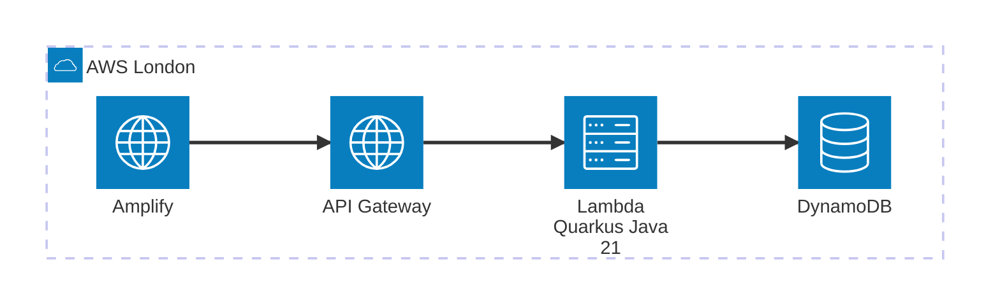

# Serverless Sudoku


A serverless Sudoku application with a Java/Quarkus backend on AWS Lambda and a React frontend on AWS Amplify.

---

## High-Level Architecture



---

## Tech Stack

| Layer      | Technology                                          |
|------------|-----------------------------------------------------|
| Frontend   | React 19, Vite 8, MUI v7                            |
| Backend    | Java 21, Quarkus 3.32.3, quarkus-amazon-lambda-rest |
| Database   | AWS DynamoDB                                        |
| Hosting    | AWS Amplify (frontend), AWS Lambda (backend)        |
| IaC        | Terraform (AWS provider, eu-west-2)                 |

---

## Repository Structure

```
sudoku-app/
├── backend/          # Java 21 + Quarkus REST API (Lambda-optimized)
│   └── src/
├── ui/               # React 19 + Vite frontend with MUI
│   ├── src/
│   └── e2e/          # Playwright E2E tests
├── infra/            # Terraform IaC (AWS eu-west-2)
├── docs/             # Architecture and coding standards
├── openapi.yaml      # API contract
├── Makefile          # Combined dev workflow
└── CLAUDE.md         # AI assistant instructions
```

---

## Prerequisites

| Tool          | Version  | Notes                                  |
|---------------|----------|----------------------------------------|
| Java          | 21       | Temurin distribution recommended       |
| Node.js       | 22       |                                        |
| Maven Wrapper | bundled  | Use `./mvnw` — no separate install     |
| Terraform     | latest   | Required for infra work only           |
| GraalVM       | optional | Required for native image builds only  |

---

## Local Development

### Backend

```bash
cd backend
./mvnw quarkus:dev   # hot reload on http://localhost:8080
```

### Frontend

```bash
cd ui
npm install
npm run dev          # dev server on http://localhost:5173
```

### Combined (both services)

```bash
make dev             # starts backend (8080) and frontend (5173) in parallel
```

### Environment Variables

Copy `ui/.env.example` to `ui/.env.development.local` and adjust as needed:

```bash
cp ui/.env.example ui/.env.development.local
```

| Variable        | Default                        | Description                        |
|-----------------|--------------------------------|------------------------------------|
| `VITE_API_URL`  | `http://localhost:8080/api/v1` | Backend API base URL               |
| `VITE_MOCK_API` | `false`                        | Set to `true` to use mock API data |

---

## API Reference

Base path: `/api/v1`. Full contract: [`openapi.yaml`](openapi.yaml).

| Method | Path                  | Description                                                    |
|--------|-----------------------|----------------------------------------------------------------|
| GET    | `/puzzles/generate`   | Generate a new puzzle (`?difficulty=easy\|medium\|hard\|expert`) |
| POST   | `/puzzles/validate`   | Validate the current board state                               |
| POST   | `/puzzles/hint`       | Get a progressive logical hint (Nudge / Focus / Reveal)        |
| POST   | `/puzzles/candidates` | Calculate all valid candidates for empty cells                 |

---

## Testing

### Backend — Unit Tests

```bash
cd backend
./mvnw test
```

### Backend — Integration Tests

```bash
cd backend
./mvnw verify -DskipITs=false
```

### Frontend — E2E Tests (Playwright)

```bash
cd ui
npm run test:e2e       # headless Chromium
npm run test:e2e:ui    # interactive Playwright UI
```

CI runs all three test suites on every push. Playwright reports are uploaded as artifacts on failure.

---

## Key Files

| File                                               | Purpose                     |
|----------------------------------------------------|-----------------------------|
| [`openapi.yaml`](openapi.yaml)                     | API contract (source of truth) |
| [`docs/backend.md`](docs/backend.md)               | Backend coding standards    |
| [`docs/frontend.md`](docs/frontend.md)             | Frontend coding standards   |
| [`docs/security.md`](docs/security.md)             | Security standards          |
| [`docs/infrastructure.md`](docs/infrastructure.md) | IaC standards               |
| [`docs/test-strategy.md`](docs/test-strategy.md)   | Test strategy               |
| [`CLAUDE.md`](CLAUDE.md)                           | AI assistant instructions   |

---

## Infrastructure

Terraform configuration lives in `infra/`. Target region: `eu-west-2` (London).

> **Status:** Provider and backend configured. Resource definitions (Lambda, API Gateway, DynamoDB, Amplify) are pending implementation.

---

## Deployment

> **Placeholder** — deployment pipeline not yet implemented.

Planned deployment targets:
- **Frontend:** AWS Amplify (Git-based CI/CD)
- **Backend:** AWS Lambda with SnapStart (JVM mode) or GraalVM native image

---

## Contributing

> **Placeholder** — contributing guidelines not yet written.
