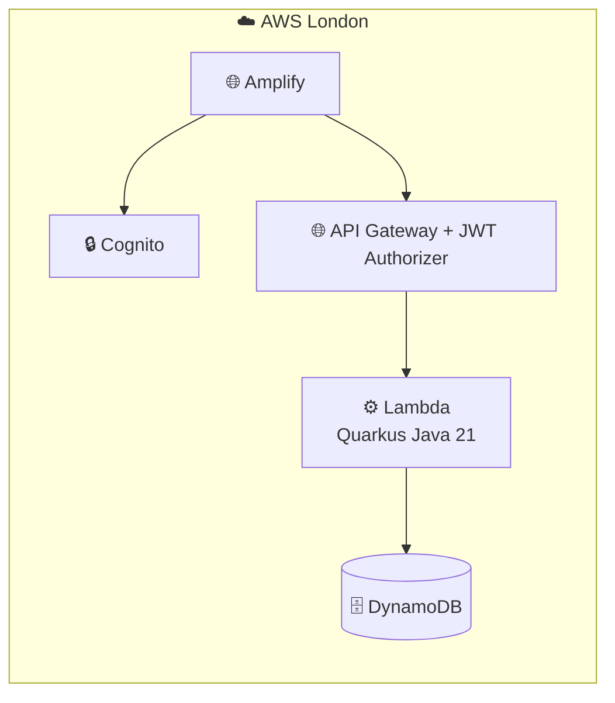

# Serverless Sudoku


A serverless Sudoku application with a Java/Quarkus backend on AWS Lambda and a React frontend on AWS Amplify.

---

## High-Level Architecture



---

## Tech Stack

| Layer      | Technology                                                         |
|------------|--------------------------------------------------------------------|
| Frontend   | React 19, Vite 8, MUI v7, aws-amplify v6                          |
| Backend    | Java 21, Quarkus 3.32.3, quarkus-amazon-lambda-rest, quarkus-oidc |
| Auth       | Amazon Cognito User Pool (Google social login via OAuth 2.0)       |
| Database   | AWS DynamoDB (`SudokuGames`, `SudokuPlayers`)                      |
| Hosting    | AWS Amplify (frontend), AWS Lambda (backend)                       |
| IaC        | Terraform (AWS provider, eu-west-2)                                |

---

## Repository Structure

```
sudoku-app/
├── backend/          # Java 21 + Quarkus REST API (Lambda-optimized)
│   └── src/
├── ui/               # React 19 + Vite frontend with MUI
│   ├── src/
│   └── e2e/          # Playwright E2E tests
├── infra/            # Terraform IaC (AWS eu-west-2)
├── docs/             # Architecture and coding standards
├── openapi.yaml      # API contract
├── Makefile          # Combined dev workflow
└── CLAUDE.md         # AI assistant instructions
```

---

## Prerequisites

| Tool          | Version  | Notes                                  |
|---------------|----------|----------------------------------------|
| Java          | 21       | Temurin distribution recommended       |
| Node.js       | 22       |                                        |
| Maven Wrapper | bundled  | Use `./mvnw` — no separate install     |
| Terraform     | latest   | Required for infra work only           |
| GraalVM       | optional | Required for native image builds only  |

---

## Local Development

### Backend

```bash
cd backend
./mvnw quarkus:dev   # hot reload on http://localhost:8080
```

### Frontend

```bash
cd ui
npm install
npm run dev          # dev server on http://localhost:5173
```

### Combined (both services)

```bash
make dev             # starts backend (8080) and frontend (5173) in parallel
```

### Environment Variables

Copy `ui/.env.example` to `ui/.env.development.local` and adjust as needed:

```bash
cp ui/.env.example ui/.env.development.local
```

| Variable                    | Default                        | Description                                      |
|-----------------------------|--------------------------------|--------------------------------------------------|
| `VITE_API_URL`              | `http://localhost:8080/api/v1` | Backend API base URL                             |
| `VITE_MOCK_API`             | `false`                        | Set to `true` to bypass auth and use mock data   |
| `VITE_COGNITO_USER_POOL_ID` | _(set by Terraform)_           | Cognito User Pool ID (not needed in mock mode)   |
| `VITE_COGNITO_CLIENT_ID`    | _(set by Terraform)_           | Cognito App Client ID (not needed in mock mode)  |
| `VITE_COGNITO_DOMAIN`       | _(set by Terraform)_           | Cognito hosted UI domain (not needed in mock mode) |

---

## API Reference

Base path: `/api/v1`. Full contract: [`openapi.yaml`](openapi.yaml).

**Public routes** (no authentication required):

| Method | Path                  | Description                                                      |
|--------|-----------------------|------------------------------------------------------------------|
| GET    | `/puzzles/generate`   | Generate a new puzzle (`?difficulty=easy\|medium\|hard\|expert`) |
| POST   | `/puzzles/validate`   | Validate the current board state                                 |
| POST   | `/puzzles/hint`       | Get a progressive logical hint (Nudge / Focus / Reveal)          |
| POST   | `/puzzles/candidates` | Calculate all valid candidates for empty cells                   |

**Protected routes** (JWT Bearer token required — issued by Cognito after Google login):

| Method | Path                  | Description                                  |
|--------|-----------------------|----------------------------------------------|
| POST   | `/puzzles/coach`      | Send a message to the AI Sudoku coach (Bedrock-backed, desktop only) |
| POST   | `/games`              | Create a new game for the authenticated user |
| GET    | `/games/{gameId}`     | Load a saved game                            |
| PATCH  | `/games/{gameId}`     | Save game progress                           |
| GET    | `/players/me`         | Get or create the current user's profile     |

---

## Testing

### Backend — Unit Tests

```bash
cd backend
./mvnw test
```

### Backend — Integration Tests

```bash
cd backend
./mvnw verify -DskipITs=false
```

### Frontend — E2E Tests (Playwright)

```bash
cd ui
npm run test:e2e       # headless Chromium
npm run test:e2e:ui    # interactive Playwright UI
```

CI runs all three test suites on every push. Playwright reports are uploaded as artifacts on failure.

---

## Key Files

| File                                               | Purpose                     |
|----------------------------------------------------|-----------------------------|
| [`openapi.yaml`](openapi.yaml)                                       | API contract (source of truth)           |
| [`docs/standards/java-quarkus.md`](docs/standards/java-quarkus.md)   | Backend coding standards                 |
| [`docs/llds/react-frontend.md`](docs/llds/react-frontend.md)         | Frontend LLD + coding standards          |
| [`docs/arrows/security-standards.md`](docs/arrows/security-standards.md) | Security standards (IAM, throttling, IDOR) |
| [`docs/arrows/testing-strategy.md`](docs/arrows/testing-strategy.md) | Test strategy                            |
| [`docs/llds/user-management.md`](docs/llds/user-management.md)       | Auth standards (Cognito, JWT, OIDC)      |
| [`docs/llds/cloud-platform.md`](docs/llds/cloud-platform.md)         | IaC standards + CI/CD pipeline           |
| [`CLAUDE.md`](CLAUDE.md)                                             | AI assistant instructions                |

---

## Infrastructure

Terraform configuration lives in `infra/`. Target region: `eu-west-2` (London).

See [`infra/README.md`](infra/README.md) for the full infrastructure reference including architecture diagram, resource details, bootstrap instructions, and local operations.

---

## Deployment

Deployment is automated via GitHub Actions on push to `main` or `rc-*` branches:

1. Maven builds `backend/target/function.zip`
2. Terraform authenticates via OIDC and runs `init → plan → apply`
3. A post-apply step tightens API Gateway CORS to the exact Amplify URL
4. A post-apply step pins Cognito callback URLs to the exact Amplify URL
5. Amplify build is triggered and waited on
6. Workflow summary prints the API Gateway and Amplify URLs

A manual **Teardown** workflow is available via GitHub Actions (`workflow_dispatch`) for full `terraform destroy`.

See [`infra/README.md`](infra/README.md) for bootstrap steps required before the first deploy.

---

## Contributing

## TODO

See [TODO.md](TODO.md) for the full backlog. Run `/extract-todos` to refresh it.