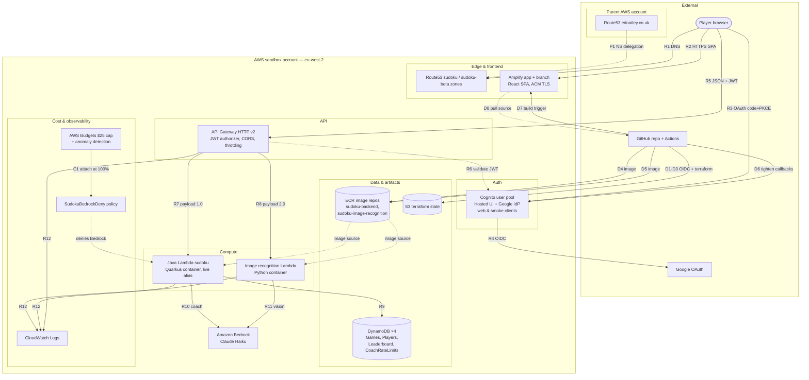

# Solution Architecture — Serverless Sudoku

**Created**: 2026-07-08
**Source of truth**: `infra/aws/*.tf` as of this date (where `infra/aws/README.md` or `docs/llds/cloud-platform.md` disagree, the code wins — drift is catalogued in `docs/planning/old/infra-review.md` §L5).
**Purpose**: describe every component and every connection precisely enough that this document can be converted directly into an architectural diagram. §2 lists the boxes, §3 lists the arrows, §6 is a ready-made Mermaid rendering.

## 1. Solution overview

A serverless Sudoku web application in AWS **eu-west-2** (sandbox account). A React SPA hosted on **AWS Amplify** talks to an **API Gateway HTTP API (v2)** fronting two Lambdas — a Java/Quarkus game API and a Python image-recognition service, both deployed as container images (Bedrock vision on the latter) — backed by four **DynamoDB** tables. Authentication is **Cognito** with Google as the only identity provider. DNS is delegated from a parent AWS account. Everything is Terraform-managed except a small bootstrap set (state bucket, GitHub OIDC role, ECR repositories). Terraform **workspaces** provide environment isolation: `default` = production, `rc-*` = per-branch release candidates, `rc-shared` = Cognito pool shared by all RC environments.

## 2. Component inventory

Diagram convention: each row is a box; the **Zone** column is its containing boundary (nested boxes).

### 2.1 External actors (outside the AWS sandbox account)

| Component | What it is | Connects to |
| --- | --- | --- |
| Browser / player | React 19 SPA running client-side | Amplify, Cognito Hosted UI, API Gateway |
| Google OAuth 2.0 | Sole identity provider | Federated into Cognito |
| GitHub (`edoatley/sudoku-app`) | Source repo + Actions CI/CD | Amplify pulls source; Actions deploys via OIDC |
| Parent AWS account | Owns Route53 zone `edoatley.co.uk` | NS-delegates both sudoku subdomains (one-time manual step) |

### 2.2 Edge & frontend (sandbox account)

| Component | Terraform | Key configuration | Environment behaviour |
| --- | --- | --- | --- |
| Route53 zone `sudoku.edoatley.co.uk` | `domain.tf` | Delegated from parent account | Created in `default` only |
| Route53 zone `sudoku-beta.edoatley.co.uk` | `domain.tf` | Delegated from parent account | Created in `default`; `rc-*` read its ID via remote state |
| Amplify app `sudoku{suffix}` + branch | `amplify.tf` | Build: `cd ui && npm ci && npm run build` → `ui/dist`; auto-build **off** (CI triggers post-Terraform so `VITE_*` vars are fresh); env vars below | Branch `main`/`PRODUCTION` on default; git branch/`DEVELOPMENT` on others |
| Amplify domain association | `domain.tf` | Provisions ACM cert automatically; `wait_for_verification=false` (CI polls) | `sudoku.` + `www.sudoku.` → default; `sudoku-beta.` → current `rc-*` (last writer wins) |

`VITE_*` variables baked into the JS bundle at Amplify build time: `VITE_API_URL` (API GW endpoint + `/api/v1`), `VITE_COGNITO_USER_POOL_ID`, `VITE_COGNITO_CLIENT_ID`, `VITE_COGNITO_DOMAIN`, `VITE_MOCK_API=false`, `VITE_DEV_TOOLS` (false on default), `VITE_AI_COACH` (false on default, true elsewhere).

### 2.3 Authentication (Cognito)

| Component | Terraform | Key configuration | Environment behaviour |
| --- | --- | --- | --- |
| User pool `sudoku{suffix}` | `cognito.tf` | Social-only (admin-create-user only), Google IdP, email auto-verified, MFA off | Owned by `default` and non-RC workspaces |
| User pool `sudoku-rc` | `cognito-rc-shared.tf` | Same shape; owned by the `rc-shared` workspace | All `rc-*` workspaces reference it via data sources (one Google redirect URI for all RC branches) |
| Hosted UI domain | `cognito.tf` / `cognito-rc-shared.tf` | `sudoku-auth{suffix}` / `sudoku-auth-rc` `.auth.eu-west-2.amazoncognito.com` | Per pool |
| Google identity provider | both cognito files | OAuth scopes `openid email profile`; maps email/name/sub | Per pool |
| App client `sudoku-web{suffix}` | both | Public (no secret), auth-code flow, Google-only IdP, no `USER_PASSWORD_AUTH` (social login only); callback URLs baseline then tightened post-deploy (`ignore_changes`) | Per pool |
| App client `sudoku-smoke-test{suffix}` | both | Confidential (secret), `USER_PASSWORD_AUTH`; used by CI smoke tests (`SECRET_HASH`-authenticated) | Per pool |
| Smoke-test user | both | Admin-created, permanent password, never surfaced in UI | Per pool |

### 2.4 API layer

| Component | Terraform | Key configuration | Environment behaviour |
| --- | --- | --- | --- |
| API Gateway HTTP API `sudoku{suffix}` | `api_gateway.tf` (module `terraform-aws-modules/apigateway-v2 ~> 6.1`) | `$default` stage, auto-deploy; throttle 25 req/s / 50 burst; CORS origins = custom domain + localhost (methods GET/POST/PATCH/OPTIONS) | Per workspace |
| JWT authorizer `cognito-jwt{suffix}` | `api_gateway.tf` | Issuer = workspace's Cognito pool; audience = web + smoke client IDs | Per workspace |
| Access log group `/aws/apigateway/sudoku{suffix}` | `api_gateway.tf` | JSON access logs; retention 7d (default) / 3d | Per workspace |

Routes (each row = one arrow API GW → Lambda):

| Route | Auth | Target | Payload | Notes |
| --- | --- | --- | --- | --- |
| `$default` (catch-all) | none | Java Lambda `live` alias | 1.0 | Public paths: `/api/v1/puzzles/*`, `/api/v1/health` (see review H1 re `/dev/*`) |
| `POST /api/v1/games` | JWT | Java Lambda `live` | 1.0 | |
| `POST /api/v1/games/from-image` | JWT | Java Lambda `live` | 1.0 | |
| `GET /api/v1/games/{gameId}` | JWT | Java Lambda `live` | 1.0 | |
| `PATCH /api/v1/games/{gameId}` | JWT | Java Lambda `live` | 1.0 | |
| `GET /api/v1/games/current` | JWT | Java Lambda `live` | 1.0 | |
| `GET /api/v1/players/me` | JWT | Java Lambda `live` | 1.0 | |
| `POST /api/v1/ai/coach` | JWT | Java Lambda `live` | 1.0 | Only when AI coach enabled (currently non-default workspaces); extra route throttle 5 req/s / 10 burst |
| `POST /api/v1/ai/image-to-puzzle` | JWT | Image recognition Lambda | 2.0 | |
| `GET /api/v1/ai/image-to-puzzle/warmup` | none | Image recognition Lambda | 2.0 | Cold-start probe, no Bedrock call |

### 2.5 Compute

| Component | Terraform | Key configuration | Environment behaviour |
| --- | --- | --- | --- |
| Java Lambda `sudoku{suffix}` | `lambda.tf` (module `terraform-aws-modules/lambda ~> 8.8`) | Container image (`Dockerfile.jvm-lwa`, same artifact as GCP Cloud Run), 512 MB, 8 s, x86_64, published versions + `live` alias (API GW invokes the alias); no SnapStart (unsupported for container-image Lambdas); deployed from ECR `sudoku-backend:{branch}-{sha}` | Per workspace |
| Image recognition Lambda `sudoku-image-recognition{suffix}` | `image_recognition_lambda.tf` (same module) | Container image (Python + Pillow) from ECR, 512 MB, 60 s timeout (Bedrock inference ~20 s + container cold start); no alias/versions | Per workspace |

Java Lambda environment: `CORS_ALLOWED_ORIGINS`, `DYNAMODB_TABLE_NAME`, `PLAYERS_TABLE_NAME`, `COACH_RATE_LIMIT_TABLE_NAME`, `COGNITO_ISSUER_URL`, `COGNITO_CLIENT_ID`.
Image Lambda environment: `AWS_REGION_NAME`, `BEDROCK_MODELS` (from `local.bedrock_models`, currently `eu.anthropic.claude-haiku-4-5-20251001-v1:0`).

### 2.6 Data & artifacts

| Component | Terraform | Key configuration | Environment behaviour |
| --- | --- | --- | --- |
| DynamoDB `SudokuGames{suffix}` | `dynamodb.tf` | PK `userId`, SK `gameId`; on-demand billing | PITR on default only |
| DynamoDB `SudokuPlayers{suffix}` | `dynamodb.tf` | PK `userId`; player profile incl. AI-coach toggle + monthly token counter | PITR on default only |
| DynamoDB `SudokuLeaderboard{suffix}` | `dynamodb.tf` | PK `userId` | PITR on default only |
| DynamoDB `SudokuCoachRateLimits{suffix}` | `dynamodb.tf` | PK `userId`, SK `window` (UTC minute); TTL `expiresAt` | Ephemeral counters, PITR off |
| ECR `sudoku-backend` | data source only | Tags `{branch}-{sha}`, `{branch}-latest` | Created by `scripts/infra/aws/bootstrap.sh` (outside Terraform); shared by all workspaces |
| ECR `sudoku-image-recognition` | data source only | Tags `{branch}-{sha}`, `{branch}-latest` | Created by `scripts/infra/aws/bootstrap.sh` (outside Terraform); shared by all workspaces |
| S3 `sudoku-tf-state` | backend config | Terraform state, encrypted, native S3 locking | Bootstrap-created; one key per workspace |

### 2.7 AI

| Component | Terraform | Key configuration |
| --- | --- | --- |
| Amazon Bedrock | referenced via IAM only | Inference profile `eu.anthropic.claude-haiku-4-5-20251001-v1:0` (single source of truth: `local.bedrock_models` in `main.tf`). Used by the image recognition Lambda (grid extraction from photos) and the Java Lambda (AI coach, feature-flagged). |

### 2.8 IAM

| Role / policy | Terraform | Grants |
| --- | --- | --- |
| `SudokuLambdaExecRole{suffix}` | `iam.tf` | Java Lambda execution role |
| ├ `AWSLambdaBasicExecutionRole` | managed | CloudWatch Logs |
| ├ `SudokuDynamoDBPolicy{suffix}` | `iam.tf` | Games: Get/Put/Update/Query/Scan |
| ├ `SudokuPlayersPolicy{suffix}` | `iam.tf` | Players: Get/Put/Update/Scan |
| ├ `SudokuLeaderboardPolicy{suffix}` | `iam.tf` | Leaderboard: Get/Update/Scan |
| ├ `SudokuCoachRateLimitsPolicy{suffix}` | `iam.tf` | RateLimits: Get/Update |
| └ `SudokuCoachBedrockPolicy{suffix}` | `iam.tf` | `bedrock:InvokeModel` on profile + foundation-model ARNs |
| `SudokuImageRecognitionExecRole{suffix}` | `image_recognition_lambda.tf` | Basic execution + `SudokuImageRecognitionBedrockPolicy{suffix}` (same Bedrock grant) |
| `SudokuBudgetsExecutionRole` | `budgets.tf` | Lets AWS Budgets attach/detach `SudokuBedrockDeny` on the Java Lambda role |
| `SudokuBedrockDeny` | `budgets.tf` | Deny all Bedrock invocation — attached automatically at budget cap |
| `sudoku-github-actions-deploy` | bootstrap script | Assumed by GitHub Actions via OIDC provider `token.actions.githubusercontent.com` |

### 2.9 Cost & observability (default workspace only, when `budget_alert_email` set)

| Component | Terraform | Behaviour |
| --- | --- | --- |
| Budget `SudokuBedrockMonthly` | `budgets.tf` | $25/month Bedrock spend; email at 80% actual and 100% forecast |
| Budget action | `budgets.tf` | At 100% actual: auto-attaches `SudokuBedrockDeny` to `SudokuLambdaExecRole` (deny overrides allow → coach degrades gracefully; auto-detached next billing month) |
| Anomaly monitor + subscription | `budgets.tf` | Per-service dimensional monitor; email on ≥$5/day anomalous spend |
| CloudWatch log groups | `lambda.tf`, `image_recognition_lambda.tf`, `api_gateway.tf` | One per Lambda + API GW access logs; 7d retention (default) / 3d (others) |

## 3. Connections (the arrows)

Runtime, request path:

| # | From → To | Protocol / purpose |
| --- | --- | --- |
| R1 | Browser → Route53 `sudoku(-beta).edoatley.co.uk` | DNS resolution (zone NS-delegated from parent account, edge P1) |
| R2 | Browser → Amplify | HTTPS: static SPA assets (custom domain, ACM TLS) |
| R3 | Browser → Cognito Hosted UI | OAuth 2.0 authorization-code + PKCE (web client) |
| R4 | Cognito → Google | OIDC federation; email/name/sub mapped into the pool |
| R5 | Browser → API Gateway | HTTPS JSON, `Authorization: Bearer <ID token>` on protected routes; CORS enforced at gateway |
| R6 | API Gateway → Cognito | JWT authorizer validates issuer + audience (web & smoke clients) via JWKS |
| R7 | API Gateway → Java Lambda **`live` alias** | Proxy integration, payload 1.0 (routes table §2.4) |
| R8 | API Gateway → Image recognition Lambda | Proxy integration, payload 2.0 (`/ai/image-to-puzzle*`) |
| R9 | Java Lambda → DynamoDB ×4 | AWS SDK; per-table IAM (§2.8) |
| R10 | Java Lambda → Bedrock | `InvokeModel` Claude Haiku — AI coach (feature-flagged) |
| R11 | Image recognition Lambda → Bedrock | `InvokeModel` Claude Haiku vision — grid extraction |
| R12 | Both Lambdas + API GW → CloudWatch Logs | stdout/access logs |

Cost-control plane:

| # | From → To | Purpose |
| --- | --- | --- |
| C1 | AWS Budgets → IAM (via `SudokuBudgetsExecutionRole`) | Attach `SudokuBedrockDeny` to `SudokuLambdaExecRole` at 100% actual spend |
| C2 | Budgets / Anomaly Detection → email | 80% / 100%-forecast / anomaly alerts |

Deployment plane:

| # | From → To | Purpose |
| --- | --- | --- |
| D1 | GitHub Actions → AWS STS | OIDC federation, assumes `sudoku-github-actions-deploy` |
| D2 | GitHub Actions → S3 `sudoku-tf-state` | Terraform state (per-workspace key, S3-native locking) |
| D3 | GitHub Actions → all managed resources | `terraform apply` (two-phase: domain association second, to dodge the ACM wait) |
| D4 | GitHub Actions → ECR | Docker push `sudoku-backend:{branch}-{sha}` |
| D5 | GitHub Actions → ECR | Docker push `sudoku-image-recognition:{branch}-{sha}` |
| D6 | GitHub Actions → Cognito | Post-apply: tighten web-client callback/logout URLs to the exact Amplify URL (`ignore_changes` keeps Terraform from reverting) |
| D7 | GitHub Actions → Amplify | `start-job` build trigger (auto-build disabled by design) |
| D8 | Amplify → GitHub | Pull source on build (classic OAuth token) |
| P1 | Parent account Route53 → sandbox zones | One-time manual NS delegation of both subdomains |

## 4. Environment / workspace model

| | `default` (prod) | `rc-*` (per RC branch) | `rc-shared` |
| --- | --- | --- | --- |
| Resource suffix | none | `-{workspace}` | n/a |
| Frontend URL | `sudoku.edoatley.co.uk` (+`www`) | `sudoku-beta.edoatley.co.uk` (last RC to deploy wins) | — |
| Cognito | owns pool `sudoku` | reads shared pool `sudoku-rc` | owns pool `sudoku-rc` |
| Route53 zones | owns both | reads zone IDs via remote state | — |
| API GW / Lambdas / DynamoDB / IAM | own set | own isolated set | none |
| PITR / log retention / Amplify stage | on / 7d / PRODUCTION | off / 3d / DEVELOPMENT | — |
| AI coach routes | disabled (feature flag) | enabled | — |
| Budgets & anomaly detection | created (if alert email set) | not created | — |

A non-default, non-`rc-*` workspace (feature env) gets its own Cognito pool and full stack, no custom domain.

## 5. Request lifecycles

**Page load + login**: Browser resolves `sudoku.edoatley.co.uk` (R1) → loads SPA from Amplify (R2) → redirects to Cognito Hosted UI (R3) → Google authenticates (R4) → auth code exchanged for JWT (ID/access/refresh) in the browser.

**Game API call** (e.g. `PATCH /api/v1/games/{id}`): Browser sends JSON + Bearer ID token to API Gateway (R5) → gateway CORS + throttle + JWT validation (R6) → route → Java Lambda `live` alias (R7, container image via the Lambda Web Adapter) → reads/writes `SudokuGames` (R9) → JSON response.

**Image-to-puzzle scan**: SPA may first hit the public warmup route (R8) to wake the container → `POST /api/v1/ai/image-to-puzzle` with the photo (R5, JWT) → image Lambda pre-processes with Pillow and calls Claude Haiku on Bedrock (R11) → returns the extracted 9×9 grid → SPA creates the game via `POST /api/v1/games/from-image`.

## 6. Diagram (Mermaid)

Boxes and arrows match §2/§3; labels carry the edge IDs for cross-reference.

A rendered AWS-icon version of this diagram is also available: [`docs/images/architecture.drawio.png`](images/architecture.drawio.png) (editable source: [`docs/diagram/architecture.drawio`](diagram/architecture.drawio)).

