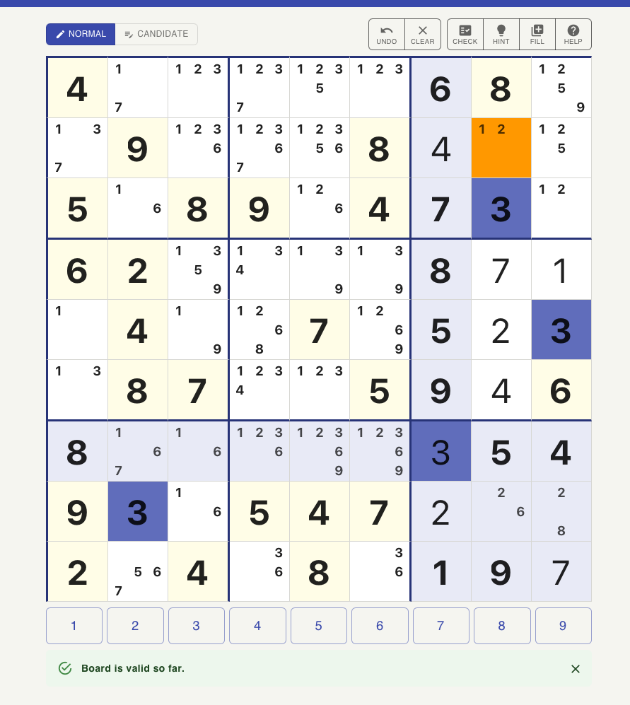

# AI Coach Manual Tests

For repeatable regression scenarios, prefer the automated suite:
`ui/tests/coach-quality/` (run via `AWS_PROFILE=sandbox bash scripts/local/coach-quality-test.sh`,
see `docs/arrows/testing-strategy.md` § Layer 2c). It drives the same conversation flow
described below against real Bedrock, and asserts against structured backend logs and the
persisted DynamoDB game row. This doc remains useful for ad hoc/exploratory sessions and as
a source of real, previously-validated puzzle grids for new scenarios.

## Attempt 1 - basic conversation

**AI Coach conversation**
```
User: I'm stuck
AI:   No worries — let's find an easy win! A 'Full House' means a row, column, or box has only one empty cell left. Scan through the rows, columns, and boxes on your board and ask yourself: which one has just a single blank? Once you spot it, only one digit can possibly go there. Give it a try!
User: is that right?
AI:   Great question! Before we check, let me ask: which row, column, or box did you think had only one empty cell? Point me to it, and we can verify together.
User: column 7 row 7
AI:   Let me check that with you. Row 7, Column 7 already has a 3 in it, so that cell is already filled! Look for an empty cell (shown as _) instead. Scan Row 7 again — which cells are actually blank?
```

**Grid:**


**Web Console Local Storage content**
| Key | Value |
|-----|-------|
| sudoku_candidateGrid | [[[],[1,7],[1,2,3],[1,2,3,7],[1,2,3,5],[1,2,3],[],[],[1,2,5,9]],[[1,3,7],[],[1,2,3,6],[1,2,3,6,7],[1,2,3,5,6],[],[],[1,2],[1,2,5]],[[],[1,6],[],[],[1,2,6],[],[],[],[1,2]],[[],[],[1,3,5,9],[1,3,4],[1,3,9],[1,3,9],[],[],[]],[[1],[],[1,9],[1,2,6,8],[],[1,2,6,9],[],[],[]],[[1,3],[],[],[1,2,3,4],[1,2,3],[],[],[],[]],[[],[1,6,7],[1,6],[1,2,3,6],[1,2,3,6,9],[1,2,3,6,9],[],[],[]],[[],[],[1,6],[],[],[],[],[2,6],[2,8]],[[],[5,6,7],[],[3,6],[],[3,6],[],[],[]]] |
| sudoku_currentGrid | [[4,0,0,0,0,0,6,8,0],[0,9,0,0,0,8,4,0,0],[5,0,8,9,0,4,7,3,0],[6,2,0,0,0,0,8,7,1],[0,4,0,0,7,0,5,2,3],[0,8,7,0,0,5,9,4,6],[8,0,0,0,0,0,3,5,4],[9,3,0,5,4,7,2,0,0],[2,0,4,0,8,0,1,9,7]] |
| sudoku_difficulty | easy |
| sudoku_elapsedSeconds | 614 |
| sudoku_gameId | 9c37eacb-8f3d-44f8-a791-d3eff79629ca |
| sudoku_hintsUsed | 0 |

**Web Console Grid as JSON**
```json
[
    [4,0,0,0,0,0,6,8,0],
    [0,9,0,0,0,8,4,0,0],
    [5,0,8,9,0,4,7,3,0],
    [6,2,0,0,0,0,8,7,1],
    [0,4,0,0,7,0,5,2,3],
    [0,8,7,0,0,5,9,4,6],
    [8,0,0,0,0,0,3,5,4],
    [9,3,0,5,4,7,2,0,0],
    [2,0,4,0,8,0,1,9,7]
]
```

**Coach logs**

```bash
AWS_PROFILE=sandbox bash scripts/logs/download-coach-logs.sh --hours 1
```

```terminaloutput
Fetching coach logs from /aws/lambda/sudoku-rc-ai-coach-improvements-1 (last 1h)...
Found 6 log event(s). Extracting JSON lines...
```

```json
{"type":"COACH_REQUEST","cid":"d884e08d-5ba2-4412-bfc0-26081848698d","modelId":"eu.anthropic.claude-haiku-4-5-20251001-v1:0","technique":"Full House","historyLen":1,"userMsgLen":9,"ts":1783671560228,"userMessage":"I'm stuck","board":[[4,0,0,0,0,0,6,8,0],[0,9,0,0,0,8,4,0,0],[5,0,8,9,0,4,7,3,0],[6,2,0,0,0,0,8,7,1],[0,4,0,0,7,0,5,2,3],[0,8,7,0,0,5,9,4,6],[8,0,0,0,0,0,0,5,4],[9,3,0,5,4,7,2,0,0],[2,0,4,0,8,0,1,9,7]],"candidatesGrid":{"rows":[[[],[1,7],[1,2,3],[1,2,3,7],[1,2,3,5],[1,2,3],[],[],[2,5,9]],[[1,3,7],[],[1,2,3,6],[1,2,3,6,7],[1,2,3,5,6],[],[],[1],[2,5]],[[],[1,6],[],[],[1,2,6],[],[],[],[2]],[[],[],[3,5,9],[3,4],[3,9],[3,9],[],[],[]],[[1],[],[1,9],[1,6,8],[],[1,6,9],[],[],[]],[[1,3],[],[],[1,2,3],[1,2,3],[],[],[],[]],[[],[1,6,7],[1,6],[1,2,3,6],[1,2,3,6,9],[1,2,3,6,9],[3],[],[]],[[],[],[1,6],[],[],[],[],[6],[8]],[[],[5,6],[],[3,6],[],[3,6],[],[],[]]]}}
{"type":"COACH_RESPONSE","cid":"d884e08d-5ba2-4412-bfc0-26081848698d","revealHint":false,"inputTokens":2376,"outputTokens":91,"cacheReadTokens":0,"cacheWriteTokens":0,"latencyMs":2499,"fallback":false,"aiMessage":"No worries — let's find an easy win! A 'Full House' means a row, column, or box has only one empty cell left. Scan through the rows, columns, and boxes on your board and ask yourself: which one has just a single blank? Once you spot it, only one digit can possibly go there. Give it a try!"}
{"type":"COACH_REQUEST","cid":"68d19672-515f-430c-95ea-1035c9fa38fb","modelId":"eu.anthropic.claude-haiku-4-5-20251001-v1:0","technique":"Naked Single","historyLen":3,"userMsgLen":14,"ts":1783671597905,"userMessage":"is that right?","board":[[4,0,0,0,0,0,6,8,0],[0,9,0,0,0,8,4,0,0],[5,0,8,9,0,4,7,3,0],[6,2,0,0,0,0,8,7,1],[0,4,0,0,7,0,5,2,3],[0,8,7,0,0,5,9,4,6],[8,0,0,0,0,0,3,5,4],[9,3,0,5,4,7,2,0,0],[2,0,4,0,8,0,1,9,7]],"candidatesGrid":{"rows":[[[],[1,7],[1,2,3],[1,2,3,7],[1,2,3,5],[1,2,3],[],[],[2,5,9]],[[1,3,7],[],[1,2,3,6],[1,2,3,6,7],[1,2,3,5,6],[],[],[1],[2,5]],[[],[1,6],[],[],[1,2,6],[],[],[],[2]],[[],[],[3,5,9],[3,4],[3,9],[3,9],[],[],[]],[[1],[],[1,9],[1,6,8],[],[1,6,9],[],[],[]],[[1,3],[],[],[1,2,3],[1,2,3],[],[],[],[]],[[],[1,6,7],[1,6],[1,2,6],[1,2,6,9],[1,2,6,9],[],[],[]],[[],[],[1,6],[],[],[],[],[6],[8]],[[],[5,6],[],[3,6],[],[3,6],[],[],[]]]}}
{"type":"COACH_RESPONSE","cid":"68d19672-515f-430c-95ea-1035c9fa38fb","revealHint":false,"inputTokens":2464,"outputTokens":54,"cacheReadTokens":0,"cacheWriteTokens":0,"latencyMs":1565,"fallback":false,"aiMessage":"Great question! Before we check, let me ask: which row, column, or box did you think had only one empty cell? Point me to it, and we can verify together."}
{"type":"COACH_REQUEST","cid":"9a37cacb-aee0-43e7-9ee1-45fd746179a5","modelId":"eu.anthropic.claude-haiku-4-5-20251001-v1:0","technique":"Naked Single","historyLen":5,"userMsgLen":14,"ts":1783671635546,"userMessage":"column 7 row 7","board":[[4,0,0,0,0,0,6,8,0],[0,9,0,0,0,8,4,0,0],[5,0,8,9,0,4,7,3,0],[6,2,0,0,0,0,8,7,1],[0,4,0,0,7,0,5,2,3],[0,8,7,0,0,5,9,4,6],[8,0,0,0,0,0,3,5,4],[9,3,0,5,4,7,2,0,0],[2,0,4,0,8,0,1,9,7]],"candidatesGrid":{"rows":[[[],[1,7],[1,2,3],[1,2,3,7],[1,2,3,5],[1,2,3],[],[],[2,5,9]],[[1,3,7],[],[1,2,3,6],[1,2,3,6,7],[1,2,3,5,6],[],[],[1],[2,5]],[[],[1,6],[],[],[1,2,6],[],[],[],[2]],[[],[],[3,5,9],[3,4],[3,9],[3,9],[],[],[]],[[1],[],[1,9],[1,6,8],[],[1,6,9],[],[],[]],[[1,3],[],[],[1,2,3],[1,2,3],[],[],[],[]],[[],[1,6,7],[1,6],[1,2,6],[1,2,6,9],[1,2,6,9],[],[],[]],[[],[],[1,6],[],[],[],[],[6],[8]],[[],[5,6],[],[3,6],[],[3,6],[],[],[]]]}}
{"type":"COACH_RESPONSE","cid":"9a37cacb-aee0-43e7-9ee1-45fd746179a5","revealHint":false,"inputTokens":2515,"outputTokens":74,"cacheReadTokens":0,"cacheWriteTokens":0,"latencyMs":1577,"fallback":false,"aiMessage":"Let me check that with you. Row 7, Column 7 already has a 3 in it, so that cell is already filled! Look for an empty cell (shown as _) instead. Scan Row 7 again — which cells are actually blank?"}
```

Reformatted to conversation to make reading easier:

```bash
pbpaste | jq -s 'group_by(.cid)[] | {cid: .[0].cid, userMessage: .[0].userMessage, aiMessage: (map(select(.type=="COACH_RESPONSE"))[0].aiMessage // "TIMED OUT")}'
```

```json
{
  "cid": "68d19672-515f-430c-95ea-1035c9fa38fb",
  "userMessage": "is that right?",
  "aiMessage": "Great question! Before we check, let me ask: which row, column, or box did you think had only one empty cell? Point me to it, and we can verify together."
}
{
  "cid": "9a37cacb-aee0-43e7-9ee1-45fd746179a5",
  "userMessage": "column 7 row 7",
  "aiMessage": "Let me check that with you. Row 7, Column 7 already has a 3 in it, so that cell is already filled! Look for an empty cell (shown as _) instead. Scan Row 7 again — which cells are actually blank?"
}
{
  "cid": "d884e08d-5ba2-4412-bfc0-26081848698d",
  "userMessage": "I'm stuck",
  "aiMessage": "No worries — let's find an easy win! A 'Full House' means a row, column, or box has only one empty cell left. Scan through the rows, columns, and boxes on your board and ask yourself: which one has just a single blank? Once you spot it, only one digit can possibly go there. Give it a try!"
}
```

<details>
<summary>Puzzle from data browser</sumamry>

```json
{
  "candidates": {
    "rows": [
      [
        [],
        [ 1, 7 ],
        [ 1, 2, 3 ],
        [ 1, 2, 3, 7 ],
        [ 1, 2, 3, 5 ],
        [ 1, 2, 3 ],
        [],
        [],
        [ 1, 2, 5, 9 ]
      ],
      [
        [ 1, 3, 7 ],
        [],
        [ 1, 2, 3, 6 ],
        [ 1, 2, 3, 6, 7 ],
        [ 1, 2, 3, 5, 6 ],
        [],
        [],
        [ 1, 2 ],
        [ 1, 2, 5 ]
      ],
      [
        [],
        [ 1, 6 ],
        [],
        [],
        [ 1, 2, 6 ],
        [],
        [],
        [],
        [ 1, 2 ]
      ],
      [
        [],
        [],
        [ 1, 3, 5, 9 ],
        [ 1, 3, 4 ],
        [ 1, 3, 9 ],
        [ 1, 3, 9 ],
        [],
        [],
        []
      ],
      [
        [ 1 ],
        [],
        [ 1, 9 ],
        [ 1, 2, 6, 8 ],
        [],
        [ 1, 2, 6, 9 ],
        [],
        [],
        []
      ],
      [
        [ 1, 3 ],
        [],
        [],
        [ 1, 2, 3, 4 ],
        [ 1, 2, 3 ],
        [],
        [],
        [],
        []
      ],
      [
        [],
        [ 1, 6, 7 ],
        [ 1, 6 ],
        [ 1, 2, 3, 6 ],
        [ 1, 2, 3, 6, 9 ],
        [ 1, 2, 3, 6, 9 ],
        [],
        [],
        []
      ],
      [
        [],
        [],
        [ 1, 6 ],
        [],
        [],
        [],
        [],
        [ 2, 6 ],
        [ 2, 8 ]
      ],
      [
        [],
        [ 5, 6, 7 ],
        [],
        [ 3, 6 ],
        [],
        [ 3, 6 ],
        [],
        [],
        []
      ]
    ]
  },
  "currentGrid": {
    "rows": [
      [ 4, 0, 0, 0, 0, 0, 6, 8, 0 ],
      [ 0, 9, 0, 0, 0, 8, 4, 0, 0 ],
      [ 5, 0, 8, 9, 0, 4, 7, 3, 0 ],
      [ 6, 2, 0, 0, 0, 0, 8, 7, 1 ],
      [ 0, 4, 0, 0, 7, 0, 5, 2, 3 ],
      [ 0, 8, 7, 0, 0, 5, 9, 4, 6 ],
      [ 8, 0, 0, 0, 0, 0, 3, 5, 4 ],
      [ 9, 3, 0, 5, 4, 7, 2, 0, 0 ],
      [ 2, 0, 4, 0, 8, 0, 1, 9, 7 ]
    ]
  },
  "difficulty": "easy",
  "endedAt": null,
  "gameId": "9c37eacb-8f3d-44f8-a791-d3eff79629ca",
  "hintsUsed": 0,
  "originalGrid": {
    "rows": [
      [ 4, 0, 0, 0, 0, 0, 6, 8, 0 ],
      [ 0, 9, 0, 0, 0, 8, 0, 0, 0 ],
      [ 5, 0, 8, 9, 0, 4, 7, 3, 0 ],
      [ 6, 2, 0, 0, 0, 0, 8, 0, 0 ],
      [ 0, 4, 0, 0, 7, 0, 5, 0, 3 ],
      [ 0, 8, 7, 0, 0, 5, 9, 0, 6 ],
      [ 8, 0, 0, 0, 0, 0, 0, 5, 4 ],
      [ 9, 3, 0, 5, 4, 7, 0, 0, 0 ],
      [ 2, 0, 4, 0, 8, 0, 1, 9, 0 ]
    ]
  },
  "score": 0,
  "solutionGrid": {
    "rows": [
      [ 4, 1, 3, 7, 5, 2, 6, 8, 9 ],
      [ 7, 9, 2, 3, 6, 8, 4, 1, 5 ],
      [ 5, 6, 8, 9, 1, 4, 7, 3, 2 ],
      [ 6, 2, 5, 4, 3, 9, 8, 7, 1 ],
      [ 1, 4, 9, 8, 7, 6, 5, 2, 3 ],
      [ 3, 8, 7, 1, 2, 5, 9, 4, 6 ],
      [ 8, 7, 6, 2, 9, 1, 3, 5, 4 ],
      [ 9, 3, 1, 5, 4, 7, 2, 6, 8 ],
      [ 2, 5, 4, 6, 8, 3, 1, 9, 7 ]
    ]
  },
  "startedAt": "2026-07-10T08:05:23.562288851Z",
  "status": "IN_PROGRESS",
  "timeSpentSeconds": 842,
  "userId": "46f212e4-3041-704f-05ee-5efdfdd881cf"
}
```

</details>

## Attempt 2 - with full puzzle logging

**AI Coach conversation**
```
User: I'm stuck
AI: No worries — let's find a cell that's almost solved! Look for an empty cell where you can work out what digit must go there by checking what's already in that row, column, and 3×3 box. Start by picking any empty cell and asking yourself: "What numbers are already used nearby?" Can you find one cell where only one digit is possible?
User: was I correct?
AI: A cell has been reduced to exactly one possible candidate.
User: I'm stuck
AI: A cell has been reduced to exactly one possible candidate.
User: <Presses fill>
User: I'm stuck
AI: Let's find that cell together! Pick any empty cell and ask yourself: what digits from 1–9 are already in that row, column, and 3×3 box? When you've ruled out all but one, you've found your move. Try starting with Row 1, Column 3 — what digits do you see already placed in Row 1, Column 3, and the top-left box?
```

**Grid:**


**Web Console Local Storage content**


| Key | Value |
|-----|-------|
| sudoku_candidateGrid | [[[],[],[2,3],[],[],[],[],[],[]],[[],[],[2,3],[],[],[],[],[],[]],[[],[],[],[],[],[],[],[],[]],[[],[],[],[],[],[],[],[],[]],[[],[],[],[],[],[],[],[],[]],[[],[],[],[],[],[],[],[],[]],[[],[],[],[],[],[],[],[],[]],[[],[],[],[],[],[],[],[],[]],[[],[],[],[],[],[],[],[],[]]] |
| sudoku_candidateGrid (after fill pressed) | sudoku_candidateGrid	[[[],[],[2,3],[1,2,3,5,6],[1,2,3,4,5,8],[2,3,4,8],[2,6],[2,4,5],[2,4,5,6]],[[],[],[2,3],[2,3,6,7,9],[2,3,7],[2,3,7,9],[],[2,7,9],[]],[[],[],[],[2,5,7,9],[2,4,5,7],[2,4,7,9],[2,9],[],[2,4,5,7,9]],[[1,3,6],[],[2,3,5,7],[2,3,5,7],[],[2,3,4,7],[1,2,3,6],[1,2,4,7],[2,3,4,6,7]],[[1,3],[2,9],[],[2,3,7],[],[2,3,7,8],[],[1,2,7,8,9],[2,3,7,9]],[[3,6],[2,6,9],[2,3,5,7,9],[2,3,5,7],[2,3,4,5,7,8],[],[2,3,6,9],[2,4,7,8,9],[2,3,4,6,7,9]],[[],[6,9],[9],[],[1,3,7],[],[],[1,9],[3,9]],[[],[],[],[],[1,2],[2,9],[1,2,9],[],[2,5,9]],[[],[4,9],[],[2,3,9],[2,3],[],[],[2,9],[]]] |
| sudoku_currentGrid | [[9,7,0,0,0,0,0,0,0],[4,5,0,0,0,0,8,0,1],[8,1,6,0,0,0,0,3,0],[0,8,0,0,9,0,0,0,0],[0,0,4,0,6,0,5,0,0],[0,0,0,0,0,1,0,0,0],[2,0,0,8,0,5,4,0,0],[7,3,8,4,0,0,0,6,0],[5,0,1,0,0,6,7,0,8]] |
| sudoku_difficulty | hard |
| sudoku_elapsedSeconds | 377 |
| sudoku_gameId | 7f382792-cb22-451f-aff4-91e56e6448c3 |
| sudoku_hintsUsed | 2 |

**Web Console Grid as JSON**
```json
[
    [9,7,0,0,0,0,0,0,0],
    [4,5,0,0,0,0,8,0,1],
    [8,1,6,0,0,0,0,3,0],
    [0,8,0,0,9,0,0,0,0],
    [0,0,4,0,6,0,5,0,0],
    [0,0,0,0,0,1,0,0,0],
    [2,0,0,8,0,5,4,0,0],
    [7,3,8,4,0,0,0,6,0],
    [5,0,1,0,0,6,7,0,8]
    ]
```

**Puzzle logs**

```bash
AWS_PROFILE=sandbox bash scripts/logs/download-puzzle-logs.sh --puzzle-id 7f382792-cb22-451f-aff4-91e56e6448c3
```

```terminaloutput
Fetching puzzle logs from /aws/lambda/sudoku-rc-detailed-puzzle-logs (last 24h)...
Found 27 log event(s). Extracting JSON lines...
```

```json
{"type":"HINT_REQUEST","pid":"7f382792-cb22-451f-aff4-91e56e6448c3","userId":"46f212e4-3041-704f-05ee-5efdfdd881cf","ts":1783681465720,"clientTs":1783681456074,"cid":"1426ca87-8d04-4b03-9fa5-277cb571c08c","excludedRanks":[]}
{"type":"HINT_RESPONSE","pid":"7f382792-cb22-451f-aff4-91e56e6448c3","userId":"46f212e4-3041-704f-05ee-5efdfdd881cf","ts":1783681465720,"clientTs":1783681456243,"cid":"1426ca87-8d04-4b03-9fa5-277cb571c08c","techniqueName":"Naked Pair","strategyRank":30,"difficulty":"easy","found":true}
{"type":"NUMBER","pid":"7f382792-cb22-451f-aff4-91e56e6448c3","userId":"46f212e4-3041-704f-05ee-5efdfdd881cf","ts":1783681525616,"clientTs":1783681510021,"r":2,"c":0,"v":8}
{"type":"NUMBER_RESULT","pid":"7f382792-cb22-451f-aff4-91e56e6448c3","userId":"46f212e4-3041-704f-05ee-5efdfdd881cf","ts":1783681525616,"clientTs":1783681510021,"r":2,"c":0,"v":8,"correct":true}
{"type":"NUMBER","pid":"7f382792-cb22-451f-aff4-91e56e6448c3","userId":"46f212e4-3041-704f-05ee-5efdfdd881cf","ts":1783681525616,"clientTs":1783681515481,"r":1,"c":0,"v":4}
{"type":"NUMBER_RESULT","pid":"7f382792-cb22-451f-aff4-91e56e6448c3","userId":"46f212e4-3041-704f-05ee-5efdfdd881cf","ts":1783681525616,"clientTs":1783681515481,"r":1,"c":0,"v":4,"correct":true}
{"type":"NUMBER","pid":"7f382792-cb22-451f-aff4-91e56e6448c3","userId":"46f212e4-3041-704f-05ee-5efdfdd881cf","ts":1783681525616,"clientTs":1783681517085,"r":2,"c":1,"v":1}
{"type":"NUMBER_RESULT","pid":"7f382792-cb22-451f-aff4-91e56e6448c3","userId":"46f212e4-3041-704f-05ee-5efdfdd881cf","ts":1783681525616,"clientTs":1783681517085,"r":2,"c":1,"v":1,"correct":true}
{"type":"NUMBER","pid":"7f382792-cb22-451f-aff4-91e56e6448c3","userId":"46f212e4-3041-704f-05ee-5efdfdd881cf","ts":1783681525616,"clientTs":1783681521327,"r":2,"c":1,"v":2}
{"type":"NUMBER_RESULT","pid":"7f382792-cb22-451f-aff4-91e56e6448c3","userId":"46f212e4-3041-704f-05ee-5efdfdd881cf","ts":1783681525616,"clientTs":1783681521327,"r":2,"c":1,"v":2,"correct":false}
{"type":"NUMBER_CLEAR","pid":"7f382792-cb22-451f-aff4-91e56e6448c3","userId":"46f212e4-3041-704f-05ee-5efdfdd881cf","ts":1783681525616,"clientTs":1783681524379,"r":2,"c":1}
{"type":"COACH_REQUEST","pid":"7f382792-cb22-451f-aff4-91e56e6448c3","cid":"8339342d-1193-438c-99d8-8261c3cf86df","modelId":"eu.anthropic.claude-haiku-4-5-20251001-v1:0","technique":"Naked Single","historyLen":1,"userMsgLen":9,"ts":1783681573921,"userMessage":"I'm stuck","board":[[9,7,0,0,0,0,0,0,0],[4,5,0,0,0,0,8,0,1],[8,1,6,0,0,0,0,3,0],[0,8,0,0,9,0,0,0,0],[0,0,4,0,6,0,5,0,0],[0,0,0,0,0,1,0,0,0],[2,0,0,8,0,5,4,0,0],[0,3,8,4,0,0,0,6,0],[5,0,1,0,0,6,7,0,8]],"candidatesGrid":{"rows":[[[],[],[2,3],[1,2,3,5,6],[1,2,3,4,5,8],[2,3,4,8],[2,6],[2,4,5],[2,4,5,6]],[[],[],[2,3],[2,3,6,7,9],[2,3,7],[2,3,7,9],[],[2,7,9],[]],[[],[],[],[2,5,7,9],[2,4,5,7],[2,4,7,9],[2,9],[],[2,4,5,7,9]],[[1,3,6,7],[],[2,3,5,7],[2,3,5,7],[],[2,3,4,7],[1,2,3,6],[1,2,4,7],[2,3,4,6,7]],[[1,3,7],[2,9],[],[2,3,7],[],[2,3,7,8],[],[1,2,7,8,9],[2,3,7,9]],[[3,6,7],[2,6,9],[2,3,5,7,9],[2,3,5,7],[2,3,4,5,7,8],[],[2,3,6,9],[2,4,7,8,9],[2,3,4,6,7,9]],[[],[6,9],[7,9],[],[1,3,7],[],[],[1,9],[3,9]],[[7],[],[],[],[1,2,7],[2,7,9],[1,2,9],[],[2,5,9]],[[],[4,9],[],[2,3,9],[2,3],[],[],[2,9],[]]]}}
{"type":"COACH_RESPONSE","pid":"7f382792-cb22-451f-aff4-91e56e6448c3","cid":"8339342d-1193-438c-99d8-8261c3cf86df","revealHint":false,"inputTokens":2364,"outputTokens":96,"cacheReadTokens":0,"cacheWriteTokens":0,"latencyMs":3006,"fallback":false,"aiMessage":"No worries — let's find a cell that's almost solved! Look for an empty cell where you can work out what digit must go there by checking what's already in that row, column, and 3×3 box. Start by picking any empty cell and asking yourself: \"What numbers are already used nearby?\" Can you find one cell where only one digit is possible?"}
{"type":"NUMBER","pid":"7f382792-cb22-451f-aff4-91e56e6448c3","userId":"46f212e4-3041-704f-05ee-5efdfdd881cf","ts":1783681585457,"clientTs":1783681529490,"r":2,"c":1,"v":1}
{"type":"NUMBER_RESULT","pid":"7f382792-cb22-451f-aff4-91e56e6448c3","userId":"46f212e4-3041-704f-05ee-5efdfdd881cf","ts":1783681585457,"clientTs":1783681529490,"r":2,"c":1,"v":1,"correct":true}
{"type":"HINT_REQUEST","pid":"7f382792-cb22-451f-aff4-91e56e6448c3","userId":"46f212e4-3041-704f-05ee-5efdfdd881cf","ts":1783681585457,"clientTs":1783681542105,"cid":"aa205040-c928-4fe2-8c4e-ddd9650f9185","excludedRanks":[30]}
{"type":"HINT_RESPONSE","pid":"7f382792-cb22-451f-aff4-91e56e6448c3","userId":"46f212e4-3041-704f-05ee-5efdfdd881cf","ts":1783681585457,"clientTs":1783681542269,"cid":"aa205040-c928-4fe2-8c4e-ddd9650f9185","techniqueName":"Naked Single","strategyRank":20,"difficulty":"easy","found":true}
{"type":"NUMBER","pid":"7f382792-cb22-451f-aff4-91e56e6448c3","userId":"46f212e4-3041-704f-05ee-5efdfdd881cf","ts":1783681705538,"clientTs":1783681665452,"r":2,"c":1,"v":7}
{"type":"NUMBER_RESULT","pid":"7f382792-cb22-451f-aff4-91e56e6448c3","userId":"46f212e4-3041-704f-05ee-5efdfdd881cf","ts":1783681705538,"clientTs":1783681665452,"r":2,"c":1,"v":7,"correct":false}
{"type":"NUMBER","pid":"7f382792-cb22-451f-aff4-91e56e6448c3","userId":"46f212e4-3041-704f-05ee-5efdfdd881cf","ts":1783681705538,"clientTs":1783681678728,"r":7,"c":0,"v":7}
{"type":"NUMBER_RESULT","pid":"7f382792-cb22-451f-aff4-91e56e6448c3","userId":"46f212e4-3041-704f-05ee-5efdfdd881cf","ts":1783681705538,"clientTs":1783681678728,"r":7,"c":0,"v":7,"correct":true}
{"type":"COACH_REQUEST","pid":"7f382792-cb22-451f-aff4-91e56e6448c3","cid":"677393a0-f1cb-4fbc-bc14-0a6e4510ed89","modelId":"eu.anthropic.claude-haiku-4-5-20251001-v1:0","technique":"Naked Single","historyLen":3,"userMsgLen":14,"ts":1783681724680,"userMessage":"was I correct?","board":[[9,7,0,0,0,0,0,0,0],[4,5,0,0,0,0,8,0,1],[8,1,6,0,0,0,0,3,0],[0,8,0,0,9,0,0,0,0],[0,0,4,0,6,0,5,0,0],[0,0,0,0,0,1,0,0,0],[2,0,0,8,0,5,4,0,0],[7,3,8,4,0,0,0,6,0],[5,0,1,0,0,6,7,0,8]],"candidatesGrid":{"rows":[[[],[],[2,3],[1,2,3,5,6],[1,2,3,4,5,8],[2,3,4,8],[2,6],[2,4,5],[2,4,5,6]],[[],[],[2,3],[2,3,6,7,9],[2,3,7],[2,3,7,9],[],[2,7,9],[]],[[],[],[],[2,5,7,9],[2,4,5,7],[2,4,7,9],[2,9],[],[2,4,5,7,9]],[[1,3,6],[],[2,3,5,7],[2,3,5,7],[],[2,3,4,7],[1,2,3,6],[1,2,4,7],[2,3,4,6,7]],[[1,3],[2,9],[],[2,3,7],[],[2,3,7,8],[],[1,2,7,8,9],[2,3,7,9]],[[3,6],[2,6,9],[2,3,5,7,9],[2,3,5,7],[2,3,4,5,7,8],[],[2,3,6,9],[2,4,7,8,9],[2,3,4,6,7,9]],[[],[6,9],[9],[],[1,3,7],[],[],[1,9],[3,9]],[[],[],[],[],[1,2],[2,9],[1,2,9],[],[2,5,9]],[[],[4,9],[],[2,3,9],[2,3],[],[],[2,9],[]]]}}
{"type":"COACH_RESPONSE","pid":"7f382792-cb22-451f-aff4-91e56e6448c3","cid":"677393a0-f1cb-4fbc-bc14-0a6e4510ed89","revealHint":false,"inputTokens":0,"outputTokens":0,"cacheReadTokens":0,"cacheWriteTokens":0,"latencyMs":1595,"fallback":false,"aiMessage":"A cell has been reduced to exactly one possible candidate."}
{"type":"COACH_REQUEST","pid":"7f382792-cb22-451f-aff4-91e56e6448c3","cid":"f9e2d498-1453-4f91-8182-1572a8f3ab39","modelId":"eu.anthropic.claude-haiku-4-5-20251001-v1:0","technique":"Naked Single","historyLen":5,"userMsgLen":9,"ts":1783681755548,"userMessage":"I'm stuck","board":[[9,7,0,0,0,0,0,0,0],[4,5,0,0,0,0,8,0,1],[8,1,6,0,0,0,0,3,0],[0,8,0,0,9,0,0,0,0],[0,0,4,0,6,0,5,0,0],[0,0,0,0,0,1,0,0,0],[2,0,0,8,0,5,4,0,0],[7,3,8,4,0,0,0,6,0],[5,0,1,0,0,6,7,0,8]],"candidatesGrid":{"rows":[[[],[],[2,3],[1,2,3,5,6],[1,2,3,4,5,8],[2,3,4,8],[2,6],[2,4,5],[2,4,5,6]],[[],[],[2,3],[2,3,6,7,9],[2,3,7],[2,3,7,9],[],[2,7,9],[]],[[],[],[],[2,5,7,9],[2,4,5,7],[2,4,7,9],[2,9],[],[2,4,5,7,9]],[[1,3,6],[],[2,3,5,7],[2,3,5,7],[],[2,3,4,7],[1,2,3,6],[1,2,4,7],[2,3,4,6,7]],[[1,3],[2,9],[],[2,3,7],[],[2,3,7,8],[],[1,2,7,8,9],[2,3,7,9]],[[3,6],[2,6,9],[2,3,5,7,9],[2,3,5,7],[2,3,4,5,7,8],[],[2,3,6,9],[2,4,7,8,9],[2,3,4,6,7,9]],[[],[6,9],[9],[],[1,3,7],[],[],[1,9],[3,9]],[[],[],[],[],[1,2],[2,9],[1,2,9],[],[2,5,9]],[[],[4,9],[],[2,3,9],[2,3],[],[],[2,9],[]]]}}
{"type":"COACH_RESPONSE","pid":"7f382792-cb22-451f-aff4-91e56e6448c3","cid":"f9e2d498-1453-4f91-8182-1572a8f3ab39","revealHint":false,"inputTokens":0,"outputTokens":0,"cacheReadTokens":0,"cacheWriteTokens":0,"latencyMs":2082,"fallback":false,"aiMessage":"A cell has been reduced to exactly one possible candidate."}
{"type":"COACH_REQUEST","pid":"7f382792-cb22-451f-aff4-91e56e6448c3","cid":"387f1839-eff9-4d66-bd13-506139e1b0ae","modelId":"eu.anthropic.claude-haiku-4-5-20251001-v1:0","technique":"Naked Single","historyLen":6,"userMsgLen":9,"ts":1783681930160,"userMessage":"I'm stuck","board":[[9,7,0,0,0,0,0,0,0],[4,5,0,0,0,0,8,0,1],[8,1,6,0,0,0,0,3,0],[0,8,0,0,9,0,0,0,0],[0,0,4,0,6,0,5,0,0],[0,0,0,0,0,1,0,0,0],[2,0,0,8,0,5,4,0,0],[7,3,8,4,0,0,0,6,0],[5,0,1,0,0,6,7,0,8]],"candidatesGrid":{"rows":[[[],[],[2,3],[1,2,3,5,6],[1,2,3,4,5,8],[2,3,4,8],[2,6],[2,4,5],[2,4,5,6]],[[],[],[2,3],[2,3,6,7,9],[2,3,7],[2,3,7,9],[],[2,7,9],[]],[[],[],[],[2,5,7,9],[2,4,5,7],[2,4,7,9],[2,9],[],[2,4,5,7,9]],[[1,3,6],[],[2,3,5,7],[2,3,5,7],[],[2,3,4,7],[1,2,3,6],[1,2,4,7],[2,3,4,6,7]],[[1,3],[2,9],[],[2,3,7],[],[2,3,7,8],[],[1,2,7,8,9],[2,3,7,9]],[[3,6],[2,6,9],[2,3,5,7,9],[2,3,5,7],[2,3,4,5,7,8],[],[2,3,6,9],[2,4,7,8,9],[2,3,4,6,7,9]],[[],[6,9],[9],[],[1,3,7],[],[],[1,9],[3,9]],[[],[],[],[],[1,2],[2,9],[1,2,9],[],[2,5,9]],[[],[4,9],[],[2,3,9],[2,3],[],[],[2,9],[]]]}}
{"type":"COACH_RESPONSE","pid":"7f382792-cb22-451f-aff4-91e56e6448c3","cid":"387f1839-eff9-4d66-bd13-506139e1b0ae","revealHint":false,"inputTokens":2447,"outputTokens":106,"cacheReadTokens":0,"cacheWriteTokens":0,"latencyMs":1834,"fallback":false,"aiMessage":"Let's find that cell together! Pick any empty cell and ask yourself: what digits from 1–9 are already in that row, column, and 3×3 box? When you've ruled out all but one, you've found your move. Try starting with Row 1, Column 3 — what digits do you see already placed in Row 1, Column 3, and the top-left box?"}
```

Summary:

```bash
AWS_PROFILE=sandbox bash scripts/logs/download-puzzle-logs.sh --summary --puzzle-id 7f382792-cb22-451f-aff4-91e56e6448c3
```

```terminaloutput
Puzzle 7f382792-cb22-451f-aff4-91e56e6448c3   user=46f212e4-3041-704f-05ee-5efdfdd881cf
  span:    2026-07-10T11:04:25Z  ->  2026-07-10T11:12:10Z
  numbers: 7 placed  (5 correct, 2 incorrect)
  clears:  1
  hints:   2  [Naked Pair x1, Naked Single x1]
  coach:   4 turn(s)
```

<details>
<summary>Puzzle from data browser</sumamry>

```json
{
  "candidates": {
    "rows": [
      [
        [],
        [],
        [ 2, 3 ],
        [ 1, 2, 3, 5, 6 ],
        [ 1, 2, 3, 4, 5, 8 ],
        [ 2, 3, 4, 8 ],
        [ 2, 6 ],
        [ 2, 4, 5 ],
        [ 2, 4, 5, 6 ]
      ],
      [
        [],
        [],
        [ 2, 3 ],
        [ 2, 3, 6, 7, 9 ],
        [ 2, 3, 7 ],
        [ 2, 3, 7, 9 ],
        [],
        [ 2, 7, 9 ],
        []
      ],
      [
        [],
        [],
        [],
        [ 2, 5, 7, 9 ],
        [ 2, 4, 5, 7 ],
        [ 2, 4, 7, 9 ],
        [ 2, 9 ],
        [],
        [ 2, 4, 5, 7, 9 ]
      ],
      [
        [ 1, 3, 6 ],
        [],
        [ 2, 3, 5, 7 ],
        [ 2, 3, 5, 7 ],
        [],
        [ 2, 3, 4, 7 ],
        [ 1, 2, 3, 6 ],
        [ 1, 2, 4, 7 ],
        [ 2, 3, 4, 6, 7 ]
      ],
      [
        [ 1, 3 ],
        [ 2, 9 ],
        [],
        [ 2, 3, 7 ],
        [],
        [ 2, 3, 7, 8 ],
        [],
        [ 1, 2, 7, 8, 9 ],
        [ 2, 3, 7, 9 ]
      ],
      [
        [ 3, 6 ],
        [ 2, 6, 9 ],
        [ 2, 3, 5, 7, 9 ],
        [ 2, 3, 5, 7 ],
        [ 2, 3, 4, 5, 7, 8 ],
        [],
        [ 2, 3, 6, 9 ],
        [ 2, 4, 7, 8, 9 ],
        [ 2, 3, 4, 6, 7, 9 ]
      ],
      [
        [],
        [ 6, 9 ],
        [ 9 ],
        [],
        [ 1, 3, 7 ],
        [],
        [],
        [ 1, 9 ],
        [ 3, 9 ]
      ],
      [
        [],
        [],
        [],
        [],
        [ 1, 2 ],
        [ 2, 9 ],
        [ 1, 2, 9 ],
        [],
        [ 2, 5, 9 ]
      ],
      [
        [],
        [ 4, 9 ],
        [],
        [ 2, 3, 9 ],
        [ 2, 3 ],
        [],
        [],
        [ 2, 9 ],
        []
      ]
    ]
  },
  "currentGrid": {
    "rows": [
      [ 9, 7, 0, 0, 0, 0, 0, 0, 0 ],
      [ 4, 5, 0, 0, 0, 0, 8, 0, 1 ],
      [ 8, 1, 6, 0, 0, 0, 0, 3, 0 ],
      [ 0, 8, 0, 0, 9, 0, 0, 0, 0 ],
      [ 0, 0, 4, 0, 6, 0, 5, 0, 0 ],
      [ 0, 0, 0, 0, 0, 1, 0, 0, 0 ],
      [ 2, 0, 0, 8, 0, 5, 4, 0, 0 ],
      [ 7, 3, 8, 4, 0, 0, 0, 6, 0 ],
      [ 5, 0, 1, 0, 0, 6, 7, 0, 8 ]
    ]
  },
  "difficulty": "hard",
  "endedAt": null,
  "gameId": "7f382792-cb22-451f-aff4-91e56e6448c3",
  "hintsUsed": 2,
  "originalGrid": {
    "rows": [
      [ 9, 7, 0, 0, 0, 0, 0, 0, 0 ],
      [ 0, 5, 0, 0, 0, 0, 8, 0, 1 ],
      [ 0, 0, 6, 0, 0, 0, 0, 3, 0 ],
      [ 0, 8, 0, 0, 9, 0, 0, 0, 0 ],
      [ 0, 0, 4, 0, 6, 0, 5, 0, 0 ],
      [ 0, 0, 0, 0, 0, 1, 0, 0, 0 ],
      [ 2, 0, 0, 8, 0, 5, 4, 0, 0 ],
      [ 0, 3, 8, 4, 0, 0, 0, 6, 0 ],
      [ 0, 0, 1, 0, 0, 6, 7, 0, 8 ]
    ]
  },
  "score": 0,
  "solutionGrid": {
    "rows": [
      [ 9, 7, 2, 1, 8, 3, 6, 5, 4 ],
      [ 4, 5, 3, 6, 2, 9, 8, 7, 1 ],
      [ 8, 1, 6, 7, 5, 4, 2, 3, 9 ],
      [ 3, 8, 5, 2, 9, 7, 1, 4, 6 ],
      [ 1, 2, 4, 3, 6, 8, 5, 9, 7 ],
      [ 6, 9, 7, 5, 4, 1, 3, 8, 2 ],
      [ 2, 6, 9, 8, 7, 5, 4, 1, 3 ],
      [ 7, 3, 8, 4, 1, 2, 9, 6, 5 ],
      [ 5, 4, 1, 9, 3, 6, 7, 2, 8 ]
    ]
  },
  "startedAt": "2026-07-10T11:04:06.176240308Z",
  "status": "IN_PROGRESS",
  "timeSpentSeconds": 707,
  "userId": "46f212e4-3041-704f-05ee-5efdfdd881cf"
}
```

</details>
