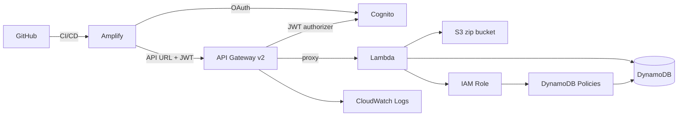

# Infrastructure

Terraform configuration for the Serverless Sudoku application. Target region: **eu-west-2** (London). AWS provider ~> 5.0.

---

## Architecture



---

## File Structure

| File | Purpose |
|------|---------|
| `terraform.tf` | Provider + S3/DynamoDB remote backend |
| `main.tf` | Data sources and locals |
| `variables.tf` | Input variables (including `google_client_id`, `google_client_secret`) |
| `outputs.tf` | Exported values (API URL, Amplify URL, Lambda name/ARN, API ID, Cognito IDs) |
| `lambda.tf` | S3 zip bucket, Lambda function, alias, and permission |
| `api_gateway.tf` | HTTP API v2, JWT authorizer, protected routes, stage, and CloudWatch log group |
| `cognito.tf` | User Pool, Google identity provider, hosted UI domain, app client |
| `dynamodb.tf` | `SudokuGames` and `SudokuPlayers` tables |
| `amplify.tf` | Amplify app and main branch |
| `iam.tf` | Lambda execution role, DynamoDB policies for SudokuGames and SudokuPlayers |

---

## Resources

### API Gateway (HTTP API v2)

- Protocol: HTTP (API Gateway v2 — not REST v1)
- Route: `$default` → catches all paths, proxied to the Lambda alias
- Stage: `$default` with `auto_deploy = true`
- Throttling: 25 req/s rate, 50 burst
- Access logs: JSON format, 7-day retention in CloudWatch

**CORS:** Uses a two-step approach to avoid a circular dependency:

1. **Terraform-managed baseline** — `https://*.amplifyapp.com` wildcard plus `http://localhost:5173`. This is broad enough to work on first deploy when the exact Amplify URL is not yet known.
2. **Post-apply tightening** — the deploy workflow calls `aws apigatewayv2 update-api` immediately after `terraform apply` to replace the wildcard with the exact Amplify URL (e.g. `https://main.abc123.amplifyapp.com`).

`ignore_changes = [cors_configuration]` prevents Terraform from reverting the tightened CORS on subsequent applies.

Allowed methods: `GET`, `POST`, `PATCH`, `OPTIONS`. Allowed headers: `Content-Type`, `Authorization`.

**JWT Authorizer:** A Cognito JWT authorizer protects the `/games/*` and `/players/me` routes. The `$default` catch-all route remains public (used by `/puzzles/*` and `/health`). HTTP API v2 uses most-specific-match routing, so explicit protected routes take priority.

### Lambda

- Runtime: `java21`, handler: `io.quarkus.amazon.lambda.runtime.QuarkusStreamHandler::handleRequest`
- Architecture: `x86_64`
- Memory: 512 MB, timeout: 5 s
- SnapStart: enabled on published versions (reduces cold starts)
- Concurrency: 10 reserved executions (cost guard)
- Deployment: zip uploaded to S3 (`sudoku-lambda-zip-{account_id}`), 30-day lifecycle on old objects
- Alias `live` always points to the current published version

### DynamoDB

**`SudokuGames`**
- Partition key: `userId` (String), sort key: `gameId` (String)
- Billing: `PAY_PER_REQUEST`
- Point-in-time recovery: enabled on `default` workspace

**`SudokuPlayers`**
- Partition key: `userId` (String)
- Billing: `PAY_PER_REQUEST`
- Point-in-time recovery: enabled on `default` workspace

### Amplify

- Source: GitHub repository (`edoatley/sudoku-app`), connected via classic OAuth token
- Build: `cd ui && npm ci && npm run build`, artifacts from `ui/dist`
- Branch: `main` → `PRODUCTION` stage, auto-build on push
- Environment variables set automatically:

| Variable | Source |
|----------|--------|
| `VITE_API_URL` | API Gateway invoke URL (Terraform output) |
| `VITE_MOCK_API` | `false` |
| `VITE_COGNITO_USER_POOL_ID` | Cognito User Pool ID (Terraform output) |
| `VITE_COGNITO_CLIENT_ID` | Cognito App Client ID (Terraform output) |
| `VITE_COGNITO_DOMAIN` | Cognito hosted UI domain (Terraform output) |

### IAM

- Role `SudokuLambdaExecRole`: assumed by `lambda.amazonaws.com`
- Attached managed policy: `AWSLambdaBasicExecutionRole` (CloudWatch Logs)
- Policy `SudokuDynamoDBPolicy`: `GetItem`, `PutItem`, `UpdateItem` on `SudokuGames`
- Policy `SudokuPlayersPolicy`: `GetItem`, `PutItem`, `UpdateItem` on `SudokuPlayers`

### Tagging

All resources receive default tags via the provider `default_tags` block:

| Tag | Value |
|-----|-------|
| `Project` | `Sudoku` |
| `ManagedBy` | `Terraform` |
| `Environment` | `prod` (default) |

---

## Multi-environment isolation

The infrastructure uses **Terraform workspaces** to give each `rc-*` branch its own isolated AWS stack, while `main` continues using the `default` workspace with unchanged resource names.

### Workspace strategy

| Branch | Workspace | Resource suffix |
|--------|-----------|-----------------|
| `main` | `default` | _(none)_ |
| `rc-infra-buildout` | `rc-infra-buildout` | `-rc-infra-buildout` |
| `rc-some-feature` | `rc-some-feature` | `-rc-some-feature` |

### Resource naming

All resource names are driven by a single `local.suffix` local in `main.tf`:

```hcl
locals {
  is_default = terraform.workspace == "default"
  suffix     = local.is_default ? "" : "-${terraform.workspace}"
}
```

Example resources for workspace `rc-infra-buildout`:

| Resource | Default name | rc-* name |
|----------|--------------|-----------|
| Lambda function | `sudoku` | `sudoku-rc-infra-buildout` |
| DynamoDB table | `SudokuGames` | `SudokuGames-rc-infra-buildout` |
| API Gateway | `sudoku` | `sudoku-rc-infra-buildout` |
| IAM role | `SudokuLambdaExecRole` | `SudokuLambdaExecRole-rc-infra-buildout` |
| Amplify app | `sudoku` | `sudoku-rc-infra-buildout` |

### State file paths (S3 backend)

Terraform automatically isolates state files per workspace:

| Workspace | S3 key |
|-----------|--------|
| `default` | `sudoku/terraform.tfstate` |
| `rc-infra-buildout` | `env:/rc-infra-buildout/sudoku/terraform.tfstate` |

No backend configuration change is required — this is standard Terraform S3 backend behaviour.

### S3 zip bucket sharing

The Lambda deployment zip bucket (`sudoku-lambda-zip-{account_id}`) is **owned by the `default` workspace** and shared by all `rc-*` workspaces via a `data "aws_s3_bucket"` reference. Each workspace writes to its own prefixed S3 key:

| Workspace | S3 key |
|-----------|--------|
| `default` | `default/function.zip` |
| `rc-infra-buildout` | `rc-infra-buildout/function.zip` |

### Cost saving on rc-* stacks

| Feature | `default` | `rc-*` |
|---------|-----------|--------|
| DynamoDB PITR | enabled | disabled |
| CloudWatch log retention | 7 days | 3 days |
| Amplify auto-branch creation | enabled | disabled |
| Amplify stage | `PRODUCTION` | `DEVELOPMENT` |

### Local operations for an rc-* workspace

```bash
cd infra

# Select (or create) a workspace
terraform workspace select rc-my-feature || terraform workspace new rc-my-feature

# Plan and apply
terraform plan  -var "github_token=<token>" -var "google_client_id=<id>" -var "google_client_secret=<secret>"
terraform apply -var "github_token=<token>" -var "google_client_id=<id>" -var "google_client_secret=<secret>"

# Switch back to default (production)
terraform workspace select default
```

### Tearing down an rc-* workspace

Trigger the **Teardown** workflow manually via GitHub Actions, supplying the workspace name (e.g. `rc-infra-buildout`). The workflow will:

1. Select the workspace
2. Run `terraform destroy`
3. Switch back to `default` and delete the workspace

Or locally:

```bash
cd infra
terraform workspace select rc-my-feature
terraform destroy -var "github_token=<token>" -var "google_client_id=<id>" -var "google_client_secret=<secret>" -var "lambda_zip_path=/dev/null"
terraform workspace select default
terraform workspace delete rc-my-feature
```

---

## Bootstrap (first-time setup)

Before the first `terraform apply` the following resources must exist. Run the bootstrap script once with valid AWS credentials:

```bash
bash scripts/bootstrap-oidc.sh
```

This creates (idempotent — safe to re-run):

| Resource | Name |
|----------|------|
| S3 state bucket | `sudoku-tf-state` |
| DynamoDB lock table | `sudoku-tf-locks` |
| GitHub OIDC provider | `token.actions.githubusercontent.com` |
| GitHub Actions deploy role | `sudoku-github-actions-deploy` |

After running, add the following GitHub Actions secrets:

| Secret | Value |
|--------|-------|
| `AWS_DEPLOY_ROLE_ARN` | printed by the script |
| `AMPLIFY_GITHUB_TOKEN` | GitHub classic OAuth token (repo scope) |
| `GOOGLE_CLIENT_ID` | OAuth 2.0 Client ID from Google Cloud Console |
| `GOOGLE_CLIENT_SECRET` | OAuth 2.0 Client Secret from Google Cloud Console |

Also add the Cognito redirect URI in Google Cloud Console before deploying:
- `https://sudoku-auth<suffix>.auth.eu-west-2.amazoncognito.com/oauth2/idpresponse`

Then initialise Terraform:

```bash
cd infra
terraform init
```

If the `SudokuGames` DynamoDB table already exists in the account, import it before applying:

```bash
terraform import aws_dynamodb_table.sudoku_games SudokuGames
```

---

## Deployment

Deployment is fully automated via GitHub Actions (`.github/workflows/deploy.yml`). It triggers on pushes to `main` or `rc-*` branches:

1. **Build backend** — Maven packages `backend/target/function.zip`
2. **Terraform deploy** — authenticates via OIDC, runs `init → plan → apply`
3. **Tighten CORS** — calls `aws apigatewayv2 update-api` with the exact Amplify URL
4. **Tighten Cognito callbacks** — calls `aws cognito-idp update-user-pool-client` to pin callback/logout URLs to the exact Amplify URL
5. **Amplify build** — triggers and waits for the Amplify build to complete
6. **Summary** — prints API Gateway and Amplify URLs to the workflow summary

A manual **Teardown** workflow (`.github/workflows/teardown.yml`) runs `terraform destroy`. It requires typing `DESTROY` as confirmation. Bootstrap resources are not destroyed.

---

## Local Operations

```bash
cd infra

# Initialise (required once after clone or provider upgrade)
terraform init

# Preview changes
terraform plan \
  -var "github_token=<token>" \
  -var "google_client_id=<id>" \
  -var "google_client_secret=<secret>"

# Apply
terraform apply \
  -var "github_token=<token>" \
  -var "google_client_id=<id>" \
  -var "google_client_secret=<secret>"

# Destroy all Terraform-managed resources
terraform destroy \
  -var "github_token=<token>" \
  -var "google_client_id=<id>" \
  -var "google_client_secret=<secret>" \
  -var "lambda_zip_path=/dev/null"
```

> **Note:** `lambda_zip_path` defaults to `../backend/target/function.zip`. Build the backend first or override with `/dev/null` for destroy-only operations.
