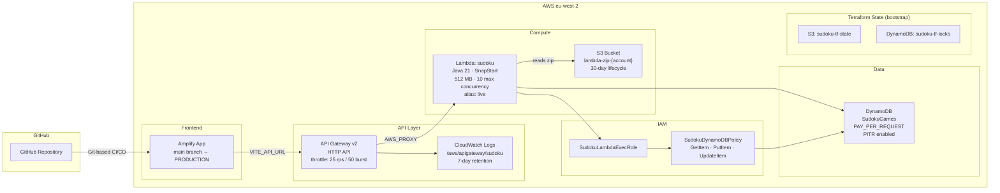

# Infrastructure

Terraform configuration for the Serverless Sudoku application. Target region: **eu-west-2** (London). AWS provider ~> 5.0.

---

## Architecture



---

## File Structure

| File | Purpose |
|------|---------|
| `terraform.tf` | Provider + S3/DynamoDB remote backend |
| `main.tf` | Data sources and locals |
| `variables.tf` | Input variables |
| `outputs.tf` | Exported values (API URL, Amplify URL, Lambda name/ARN, API ID) |
| `lambda.tf` | S3 zip bucket, Lambda function, alias, and permission |
| `api_gateway.tf` | HTTP API v2, integration, route, stage, and CloudWatch log group |
| `dynamodb.tf` | `SudokuGames` table |
| `amplify.tf` | Amplify app and main branch |
| `iam.tf` | Lambda execution role and DynamoDB policy |

---

## Resources

### API Gateway (HTTP API v2)

- Protocol: HTTP (API Gateway v2 — not REST v1)
- Route: `$default` → catches all paths, proxied to the Lambda alias
- Stage: `$default` with `auto_deploy = true`
- Throttling: 25 req/s rate, 50 burst
- Access logs: JSON format, 7-day retention in CloudWatch

**CORS:** Uses a two-step approach to avoid a circular dependency:

1. **Terraform-managed baseline** — `https://*.amplifyapp.com` wildcard plus `http://localhost:5173`. This is broad enough to work on first deploy when the exact Amplify URL is not yet known.
2. **Post-apply tightening** — the deploy workflow calls `aws apigatewayv2 update-api` immediately after `terraform apply` to replace the wildcard with the exact Amplify URL (e.g. `https://main.abc123.amplifyapp.com`).

`ignore_changes = [cors_configuration]` prevents Terraform from reverting the tightened CORS on subsequent applies.

Allowed methods: `GET`, `POST`, `OPTIONS`. Allowed headers: `Content-Type`, `Authorization`.

### Lambda

- Runtime: `java21`, handler: `io.quarkus.amazon.lambda.runtime.QuarkusStreamHandler::handleRequest`
- Architecture: `x86_64`
- Memory: 512 MB, timeout: 5 s
- SnapStart: enabled on published versions (reduces cold starts)
- Concurrency: 10 reserved executions (cost guard)
- Deployment: zip uploaded to S3 (`sudoku-lambda-zip-{account_id}`), 30-day lifecycle on old objects
- Alias `live` always points to the current published version

### DynamoDB

- Table: `SudokuGames`, partition key: `gameId` (String)
- Billing: `PAY_PER_REQUEST`
- Point-in-time recovery: enabled

### Amplify

- Source: GitHub repository (`edoatley/sudoku-app`), connected via classic OAuth token
- Build: `cd ui && npm ci && npm run build`, artifacts from `ui/dist`
- Branch: `main` → `PRODUCTION` stage, auto-build on push
- Environment variables set automatically: `VITE_API_URL` (from API Gateway output), `VITE_MOCK_API=false`

### IAM

- Role `SudokuLambdaExecRole`: assumed by `lambda.amazonaws.com`
- Attached managed policy: `AWSLambdaBasicExecutionRole` (CloudWatch Logs)
- Inline policy `SudokuDynamoDBPolicy`: `GetItem`, `PutItem`, `UpdateItem` on `SudokuGames` only

### Tagging

All resources receive default tags via the provider `default_tags` block:

| Tag | Value |
|-----|-------|
| `Project` | `Sudoku` |
| `ManagedBy` | `Terraform` |
| `Environment` | `prod` (default) |

---

## Bootstrap (first-time setup)

Before the first `terraform apply` the following resources must exist. Run the bootstrap script once with valid AWS credentials:

```bash
bash scripts/bootstrap-oidc.sh
```

This creates (idempotent — safe to re-run):

| Resource | Name |
|----------|------|
| S3 state bucket | `sudoku-tf-state` |
| DynamoDB lock table | `sudoku-tf-locks` |
| GitHub OIDC provider | `token.actions.githubusercontent.com` |
| GitHub Actions deploy role | `sudoku-github-actions-deploy` |

After running, add two GitHub Actions secrets:

| Secret | Value |
|--------|-------|
| `AWS_DEPLOY_ROLE_ARN` | printed by the script |
| `AMPLIFY_GITHUB_TOKEN` | GitHub classic OAuth token (repo scope) |

Then initialise Terraform:

```bash
cd infra
terraform init
```

If the `SudokuGames` DynamoDB table already exists in the account, import it before applying:

```bash
terraform import aws_dynamodb_table.sudoku_games SudokuGames
```

---

## Deployment

Deployment is fully automated via GitHub Actions (`.github/workflows/deploy.yml`). It triggers on pushes to `main` or `rc-*` branches:

1. **Build backend** — Maven packages `backend/target/function.zip`
2. **Terraform deploy** — authenticates via OIDC, runs `init → plan → apply`
3. **Tighten CORS** — calls `aws apigatewayv2 update-api` with the exact Amplify URL
4. **Summary** — prints API Gateway and Amplify URLs to the workflow summary

A manual **Teardown** workflow (`.github/workflows/teardown.yml`) runs `terraform destroy`. It requires typing `DESTROY` as confirmation. Bootstrap resources are not destroyed.

---

## Local Operations

```bash
cd infra

# Initialise (required once after clone or provider upgrade)
terraform init

# Preview changes
terraform plan -var "github_token=<token>"

# Apply
terraform apply -var "github_token=<token>"

# Destroy all Terraform-managed resources
terraform destroy -var "github_token=<token>" -var "lambda_zip_path=/dev/null"
```

> **Note:** `lambda_zip_path` defaults to `../backend/target/function.zip`. Build the backend first or override with `/dev/null` for destroy-only operations.
