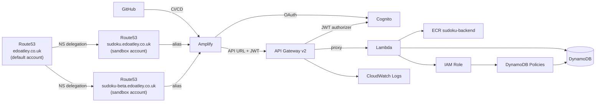

# Infrastructure

Terraform configuration for the Serverless Sudoku application. Target region: **eu-west-2** (London). AWS provider ~> 6.39.

---

## Architecture



### Custom Domains

| URL | Branch | Workspace |
|-----|--------|-----------|
| `https://sudoku.edoatley.co.uk` | `main` | `default` |
| `https://www.sudoku.edoatley.co.uk` | `main` | `default` |
| `https://sudoku-beta.edoatley.co.uk` | current `rc-*` branch | `rc-*` |

Both `sudoku.edoatley.co.uk` and `sudoku-beta.edoatley.co.uk` Route53 zones live in the **sandbox AWS account** (managed by Terraform, `default` workspace only). The parent zone `edoatley.co.uk` is in a **separate default AWS account** and delegates to each via NS records — see [DNS Delegation](#dns-delegation) below.

---

## File Structure

| File | Purpose |
|------|---------|
| `terraform.tf` | Provider + S3 remote backend |
| `main.tf` | Data sources and locals (`is_default`, `is_rc`, `suffix`) |
| `variables.tf` | Input variables |
| `outputs.tf` | Exported values (URLs, IDs, NS records) |
| `domain.tf` | Route53 hosted zone + Amplify domain associations |
| `amplify.tf` | Amplify app and branch |
| `api_gateway.tf` | HTTP API v2, JWT authorizer, routes, stage, CloudWatch log group |
| `cognito.tf` | User Pool, Google IdP, hosted UI domain, app clients |
| `cognito-rc-shared.tf` | Shared Cognito pool for all `rc-*` workspaces (applied in `rc-shared` workspace only) |
| `lambda.tf` | ECR data source, Lambda function (container image), alias |
| `iam.tf` | Lambda execution roles and DynamoDB policies |
| `dynamodb.tf` | `SudokuGames`, `SudokuPlayers`, `SudokuLeaderboard`, and `SudokuCoachRateLimits` tables |
| `image_recognition_lambda.tf` | Image recognition Lambda (Bedrock-backed, container image) |
| `scripts/infra/shared/delegate-dns.sh` | One-off script to create NS delegation in the parent AWS account |

---

## Resources

### Route53 & Custom Domains

Two hosted zones are created in the **default workspace only**:

| Zone | Used by |
|------|---------|
| `sudoku.edoatley.co.uk` | `default` workspace (production) |
| `sudoku-beta.edoatley.co.uk` | all `rc-*` workspaces (shared beta domain) |

After the first apply, update the NS delegation in the parent account for both zones — the nameservers are printed by `deploy-local.sh` and available via `terraform output subdomain_nameservers` / `terraform output sudoku_beta_nameservers`.

RC workspaces read the beta zone ID from the default workspace's remote state (`route53_beta_zone_id`) to create the `aws_amplify_domain_association.beta` resource.

`aws_amplify_domain_association` manages the DNS records and provisions the ACM certificate automatically — no separate `aws_acm_certificate` resource is needed. Certificate provisioning can take up to 40 minutes on first apply. The `wait_for_verification = false` flag prevents Terraform from blocking; `amplify-post-deploy.sh` polls instead.

### API Gateway (HTTP API v2)

- Protocol: HTTP (API Gateway v2 — not REST v1)
- Route: `$default` → catches all paths, proxied to the Lambda alias
- Stage: `$default` with `auto_deploy = true`
- Throttling: 25 req/s rate, 50 burst
- Access logs: JSON format, 7-day retention (3 days on `rc-*`)

**CORS:** Origins are set directly in `api_gateway.tf` and the Lambda's `CORS_ALLOWED_ORIGINS` env var (`lambda.tf`), so `terraform apply` always sets them correctly — no post-deploy tightening step required. The raw `*.amplifyapp.com` URL is intentionally unsupported at both layers (referencing `aws_amplify_app`/`aws_amplify_branch` from `api_gateway.tf` would create a dependency cycle). Allowed origins:

- `default` workspace: `https://sudoku.edoatley.co.uk`, `http://localhost:5173`
- `rc-*` workspaces: `https://sudoku-beta.edoatley.co.uk`, `http://localhost:5173`
- Any other workspace: `http://localhost:5173` only (no custom domain)

**JWT Authorizer:** Protects `/games/*`, `/players/me`, `/ai/coach`, and `/ai/image-to-puzzle`. The `$default` catch-all route remains public (used by `/puzzles/*` and `/health`). `/ai/image-to-puzzle/warmup` is also public (probe only, no Bedrock call).

### Lambda

- Runtime: container image (`Dockerfile.jvm-lwa` — Java 25 HTTP fast-jar + AWS Lambda Web Adapter); the same image GCP Cloud Run runs
- Architecture: `x86_64`, memory: 512 MB, timeout: 8 s
- SnapStart: not used — AWS does not support it for container-image Lambda functions
- Deployment: image pushed to ECR (`sudoku-backend`)
- Alias `live` always points to the current published version

### DynamoDB

**`SudokuGames`** — partition key: `userId`, sort key: `gameId`, `PAY_PER_REQUEST`, PITR enabled on `default`

**`SudokuPlayers`** — partition key: `userId`, `PAY_PER_REQUEST`, PITR enabled on `default`. Stores player profile including AI coach toggle and monthly token counter.

**`SudokuLeaderboard`** — partition key: `userId`, `PAY_PER_REQUEST`, PITR disabled.

**`SudokuCoachRateLimits`** — partition key: `userId`, sort key: `window` (UTC-minute string). Stores per-user per-minute call counts; TTL-based auto-expiry after 2 minutes. Used by `CoachRateLimiter` for atomic rate limiting.

### Amplify

- Source: GitHub (`edoatley/sudoku-app`), connected via classic OAuth token
- Build: `cd ui && npm ci && npm run build`, artifacts from `ui/dist`
- Auto-build is **disabled** — CI triggers the build after `terraform apply` so environment variables are set before the React bundle is compiled

| Variable | Source |
|----------|--------|
| `VITE_API_URL` | API Gateway invoke URL |
| `VITE_COGNITO_USER_POOL_ID` | Cognito User Pool ID |
| `VITE_COGNITO_CLIENT_ID` | Cognito App Client ID |
| `VITE_COGNITO_DOMAIN` | Cognito hosted UI domain |
| `VITE_DEV_TOOLS` | `false` on `default`, `true` on all others |
| `VITE_AI_COACH` | `false` on `default`, `true` on `rc-*` |

### Cognito

- Social-only sign-in (Google OAuth 2.0)
- **default workspace** owns its own User Pool (`sudoku-auth`)
- **rc-* workspaces** share a single pool (`sudoku-rc`) managed by the `rc-shared` workspace — this avoids needing a new Google OAuth redirect URI per branch
- Callback/logout URLs are set to a broad wildcard by Terraform, then tightened to exact URLs by the deploy workflow

### IAM

- Role `SudokuLambdaExecRole`: CloudWatch Logs + DynamoDB access (policies: `SudokuDynamoDBPolicy`, `SudokuPlayersPolicy`, `SudokuLeaderboardPolicy`, `SudokuCoachRateLimitsPolicy`, `SudokuCoachBedrockPolicy`)
- Role `SudokuImageRecognitionExecRole`: CloudWatch Logs + Bedrock InvokeModel (`SudokuImageRecognitionBedrockPolicy`)

### Tagging

All resources receive default tags:

| Tag | Value |
|-----|-------|
| `Project` | `Sudoku` |
| `ManagedBy` | `Terraform` |
| `Environment` | `prod` (default workspace), workspace name (rc-*) |

---

## Cost & Budget Controls

All Bedrock usage is guarded by two independent layers: per-user guardrails enforced in the
Lambda (see [`docs/llds/sudoku-coach.md`](../docs/llds/sudoku-coach.md)), and account-level
budget controls managed by Terraform.

### Layered protection overview

| Layer | Mechanism | Trigger | Scope |
|---|---|---|---|
| 1 — AI coach toggle | `aiCoachEnabled` field in player profile | User-controlled; server-enforced (403) | Per user |
| 2 — Monthly token budget | `coachTokensUsedThisMonth` in DynamoDB; checked in `CoachResource` | ≥ 100,000 tokens/month (default) | Per user |
| 3 — Per-minute rate limit | DynamoDB conditional write in `CoachRateLimiter` | ≥ 5 calls/minute | Per user |
| 4 — API Gateway throttle | Route-level throttling on `POST /ai/coach` | 10 burst / 5 req/s | All users |
| 5 — AWS Budget alert (80%) | `aws_budgets_budget` notification | > $20 actual spend | Account |
| 6 — AWS Budget alert (100% forecast) | `aws_budgets_budget` notification | Forecasted to exceed $25 | Account |
| 7 — AWS Budget hard cap | `aws_budgets_budget_action` → attaches `SudokuBedrockDeny` IAM policy | $25 actual spend reached | Account |
| 8 — Anomaly detection | `aws_ce_anomaly_subscription` | > $5 anomalous spend in a day | Account |

### AWS Budget (`budgets.tf`)

Resources are only created on the `default` workspace when `var.budget_alert_email` is set.
The budget tracks **Amazon Bedrock** spend only (not total AWS cost).

```
$0          $20           $25 ← hard cap
 |-----------|-------------|
             ↑             ↑
          80% alert     100% deny action
         (actual)       (actual)
                         + 100% forecast alert
```

**Budget action:** when actual Bedrock spend reaches 100% of the limit (`$25` by default),
AWS Budgets automatically attaches the `SudokuBedrockDeny` IAM policy to
`SudokuLambdaExecRole`. A deny in any attached policy overrides the allow in
`SudokuCoachBedrockPolicy`, so `BedrockCoachClient` receives `AccessDeniedException` and
falls back to the nudge text from the hint engine. No code change or restart is needed.

AWS Budgets detaches the policy at the start of the next billing month when spend resets.

**Anomaly detection:** a separate `aws_ce_anomaly_monitor` (dimensional, per-service) triggers
an alert when Bedrock anomalous spend exceeds $5 in a day. This catches unexpected spikes
before the monthly budget fires.

**Configuration:**

| Variable | Default | Purpose |
|---|---|---|
| `budget_alert_email` | `""` (disabled) | Email for all budget alerts and the deny action subscriber |
| `bedrock_monthly_budget_usd` | `"25"` | Monthly Bedrock spend cap in USD |

### Testing the hard cap

Use `scripts/infra/aws/test-budget-deny.sh` to verify the deny mechanism works without waiting
for real spend to reach $25:

```bash
# Verifies the deny policy attaches, blocks Bedrock, then detaches cleanly.
AWS_PROFILE=sandbox bash scripts/infra/aws/test-budget-deny.sh
```

The script uses `aws iam simulate-principal-policy` — no real Bedrock calls are made and no
spend is incurred. See the script header for full details.

---

## Multi-environment Isolation

Terraform workspaces give each `rc-*` branch its own isolated AWS stack. The `default` workspace is production.

### Workspace Strategy

| Branch | Workspace | Resource suffix | Cognito pool | Domain |
|--------|-----------|-----------------|--------------|--------|
| `main` | `default` | _(none)_ | owns `sudoku-auth` | `sudoku.edoatley.co.uk` |
| `rc-shared` | `rc-shared` | _(none)_ | creates shared `sudoku-rc` | _(none)_ |
| `rc-*` | `rc-{branch}` | `-rc-{branch}` | reads shared `sudoku-rc` | `sudoku-beta.edoatley.co.uk` |

### Cost Saving on rc-* Stacks

| Feature | `default` | `rc-*` |
|---------|-----------|--------|
| DynamoDB PITR | enabled | disabled |
| CloudWatch log retention | 7 days | 3 days |
| Amplify stage | `PRODUCTION` | `DEVELOPMENT` |
| Custom domain | `sudoku.edoatley.co.uk` | `sudoku-beta.edoatley.co.uk` (last writer wins) |

### State File Paths (S3 backend)

| Workspace | S3 key |
|-----------|--------|
| `default` | `sudoku/terraform.tfstate` |
| `rc-shared` | `env:/rc-shared/sudoku/terraform.tfstate` |
| `rc-my-feature` | `env:/rc-my-feature/sudoku/terraform.tfstate` |

### ECR Repository Sharing

The `sudoku-backend` and `sudoku-image-recognition` ECR repositories are created once (outside Terraform, by `scripts/infra/aws/bootstrap.sh`) and shared by every workspace — all workspaces reference them via a `data "aws_ecr_repository"` source. There is no per-workspace prefix; images are tagged per branch instead (`{branch}-{sha}`, `{branch}-latest`).

---

## DNS Delegation

Both hosted zones are managed in the sandbox account by Terraform (`default` workspace). The parent zone `edoatley.co.uk` lives in a separate AWS account and must be configured once to delegate to each.

**This is a one-time manual step** after the first `default` workspace apply:

1. Get the NS records from Terraform outputs:
   ```bash
   cd infra/aws
   AWS_PROFILE=sandbox terraform output subdomain_nameservers       # sudoku.edoatley.co.uk
   AWS_PROFILE=sandbox terraform output sudoku_beta_nameservers     # sudoku-beta.edoatley.co.uk
   ```
   (`deploy-local.sh` prints both automatically after a default workspace apply.)

2. In the **parent account** (default AWS profile), upsert NS records for each zone:
   ```bash
   # sudoku.edoatley.co.uk — use nameservers from subdomain_nameservers output
   aws route53 change-resource-record-sets --hosted-zone-id <PARENT_ZONE_ID> \
     --change-batch '{"Changes":[{"Action":"UPSERT","ResourceRecordSet":{"Name":"sudoku.edoatley.co.uk.","Type":"NS","TTL":172800,"ResourceRecords":[{"Value":"ns-X.awsdns-Y.com."},...]}}]}'

   # sudoku-beta.edoatley.co.uk — use nameservers from sudoku_beta_nameservers output
   aws route53 change-resource-record-sets --hosted-zone-id <PARENT_ZONE_ID> \
     --change-batch '{"Changes":[{"Action":"UPSERT","ResourceRecordSet":{"Name":"sudoku-beta.edoatley.co.uk.","Type":"NS","TTL":172800,"ResourceRecords":[{"Value":"ns-X.awsdns-Y.com."},...]}}]}'
   ```

3. Verify propagation:
   ```bash
   dig NS sudoku.edoatley.co.uk
   dig NS sudoku-beta.edoatley.co.uk
   ```

Once the NS delegation is in place, the ACM certificate will validate automatically (~5–10 minutes) and the custom domains will become live.

> **Note for rc-* workspaces:** The `sudoku-beta.edoatley.co.uk` domain association is only created after the default workspace has been applied and `route53_beta_zone_id` is present in remote state. Only one RC branch holds the beta domain at a time (last writer wins).

---

## Bootstrap (First-Time Setup)

Run once with valid sandbox AWS credentials before the first `terraform apply`:

```bash
AWS_PROFILE=sandbox bash scripts/infra/aws/bootstrap.sh
```

This creates (idempotent — safe to re-run):

| Resource | Name |
|----------|------|
| S3 state bucket | `sudoku-tf-state` |
| GitHub OIDC provider | `token.actions.githubusercontent.com` |
| GitHub Actions deploy role | `sudoku-github-actions-deploy` (inline policy: `SudokuDeployPolicy`) |
| ECR repositories | `sudoku-backend`, `sudoku-image-recognition` |

The deploy role policy covers: S3 (state), Lambda, API Gateway, Amplify, IAM (scoped to Sudoku roles/policies), ECR, Cognito, DynamoDB, CloudWatch Logs, and **Route53** (for the hosted zone and DNS records).

After running, add these GitHub Actions secrets:

| Secret | Value |
|--------|-------|
| `AWS_DEPLOY_ROLE_ARN` | printed by the script |
| `AMPLIFY_GITHUB_TOKEN` | GitHub classic OAuth token (repo scope) |
| `GOOGLE_CLIENT_ID` | OAuth 2.0 Client ID from Google Cloud Console |
| `GOOGLE_CLIENT_SECRET` | OAuth 2.0 Client Secret from Google Cloud Console |
| `SMOKE_TEST_USER_EMAIL` | Email for the smoke test Cognito user |
| `SMOKE_TEST_USER_PASSWORD` | Password for the smoke test Cognito user |
| `RC_COGNITO_WEB_CLIENT_ID` | Web client ID from the `rc-shared` workspace output |
| `RC_COGNITO_SMOKE_CLIENT_ID` | Smoke client ID from the `rc-shared` workspace output |

Add the Cognito redirect URI in Google Cloud Console:
- `https://sudoku-auth.auth.eu-west-2.amazoncognito.com/oauth2/idpresponse`
- `https://sudoku-auth-rc.auth.eu-west-2.amazoncognito.com/oauth2/idpresponse`

Then initialise Terraform:

```bash
cd infra/aws && AWS_PROFILE=sandbox terraform init
```

---

## Deployment

### CI/CD Workflows

| Workflow | Trigger | What it does |
|----------|---------|--------------|
| `ci-deploy.yml` | Push to `main` or `rc-*` | Full deploy — to `default` workspace (production) for `main`, or a named workspace per branch for `rc-*` |
| `teardown.yml` | Manual | `terraform destroy` on the `default` workspace |
| `teardown-rc.yml` | Manual | `terraform destroy` + workspace delete for a named `rc-*` workspace |

### Deploy Flow (`ci-deploy.yml`, both `main` and `rc-*`)

```
build & push backend image (ECR)
        │
        ▼
  terraform init
        │
        ▼
  terraform plan ──────────────────────────────────────────────────────┐
        │                                                               │
        ▼                                                               │
  terraform plan (phase 1, exclude domain association)                │
        │                                                               │
        ▼                                                               │
  terraform apply (phase 1) ── [main only] print Route53 NS records    │
        │                                                               │
        ▼                                                               │
  terraform apply (phase 2, full plan including domain association) ◄──┘
        │
        ▼
  tighten CORS (custom domain + raw Amplify URL)
        │
        ▼
  tighten Cognito callback URLs
        │
        ▼
  trigger Amplify build + wait
        │
        ▼
  smoke tests (API + Playwright)
```

Phase 1 creates everything except the `aws_amplify_domain_association` resource (which can take up to 40 minutes for ACM certificate provisioning).
This ensures all other resources — and the Route53 NS records — are available immediately even if the domain association step is slow.

### Local Deploy

Use `scripts/infra/aws/deploy-local.sh` to mirror the CI deploy locally:

```bash
# Secrets are loaded from scripts/.env.local if present (see setup-local-secrets.sh)
bash scripts/infra/aws/deploy-local.sh          # uses current git branch
bash scripts/infra/aws/deploy-local.sh main     # force production workspace
bash scripts/infra/aws/deploy-local.sh rc-foo   # force rc-foo workspace
```

The script handles workspace selection, reusing (or looking up) the currently deployed backend/image-recognition images, two-phase apply, NS record printing, and CORS/Cognito tightening.

### Tearing Down an rc-* Workspace

Via GitHub Actions — trigger `teardown-rc.yml` and supply the workspace name.

Locally:

```bash
cd infra/aws
AWS_PROFILE=sandbox terraform workspace select rc-my-feature
AWS_PROFILE=sandbox terraform destroy \
  -var "github_token=<token>" \
  -var "google_client_id=<id>" \
  -var "google_client_secret=<secret>" \
  -var "backend_image_uri=000000000000.dkr.ecr.eu-west-2.amazonaws.com/placeholder:latest"
AWS_PROFILE=sandbox terraform workspace select default
AWS_PROFILE=sandbox terraform workspace delete rc-my-feature
```

---

## Outputs

| Output | Description | Workspaces |
|--------|-------------|------------|
| `amplify_app_url` | Primary app URL (custom domain when available) | all |
| `amplify_default_url` | Raw Amplify URL — used for readiness probes | all |
| `amplify_app_id` | Amplify app ID | all |
| `api_gateway_url` | API Gateway invoke URL | all |
| `api_gateway_api_id` | API Gateway ID (used to tighten CORS) | all |
| `cognito_user_pool_id` | Cognito User Pool ID | all |
| `cognito_client_id` | Cognito web app client ID | all |
| `cognito_domain` | Cognito hosted UI domain | all |
| `cognito_smoke_test_client_id` | Smoke test client ID | all |
| `cognito_smoke_test_client_secret` | Smoke test client secret (sensitive) | all |
| `subdomain_nameservers` | NS records for `sudoku.edoatley.co.uk` | `default` only |
| `route53_zone_id` | Zone ID for `sudoku.edoatley.co.uk` (read by rc-* workspaces via remote state) | `default` only |
| `sudoku_beta_nameservers` | NS records for `sudoku-beta.edoatley.co.uk` | `default` only |
| `route53_beta_zone_id` | Zone ID for `sudoku-beta.edoatley.co.uk` (read by rc-* workspaces via remote state) | `default` only |
| `lambda_function_name` | Lambda function name | all |
| `lambda_function_arn` | Lambda function ARN | all |
| `image_recognition_lambda_function_name` | Image recognition Lambda name | all |
| `image_recognition_ecr_repository_url` | ECR repository URL | all |
